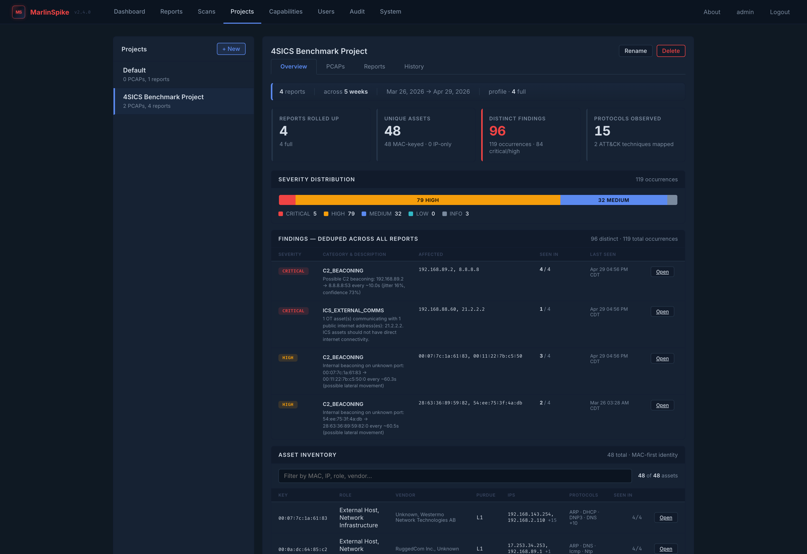
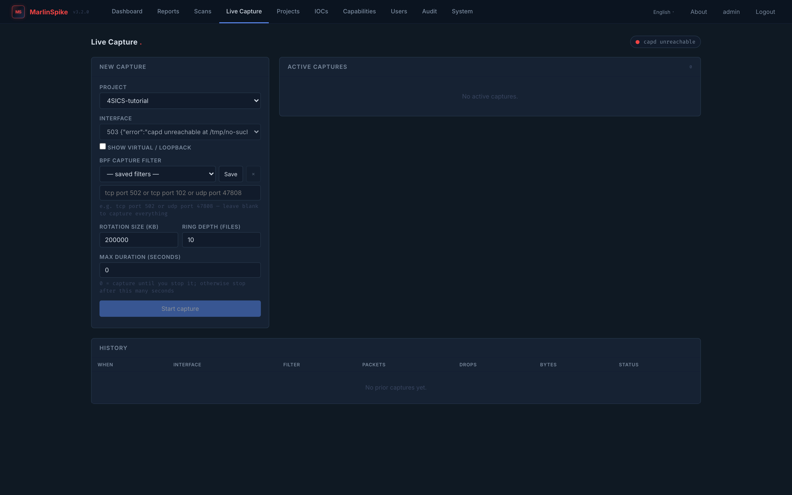
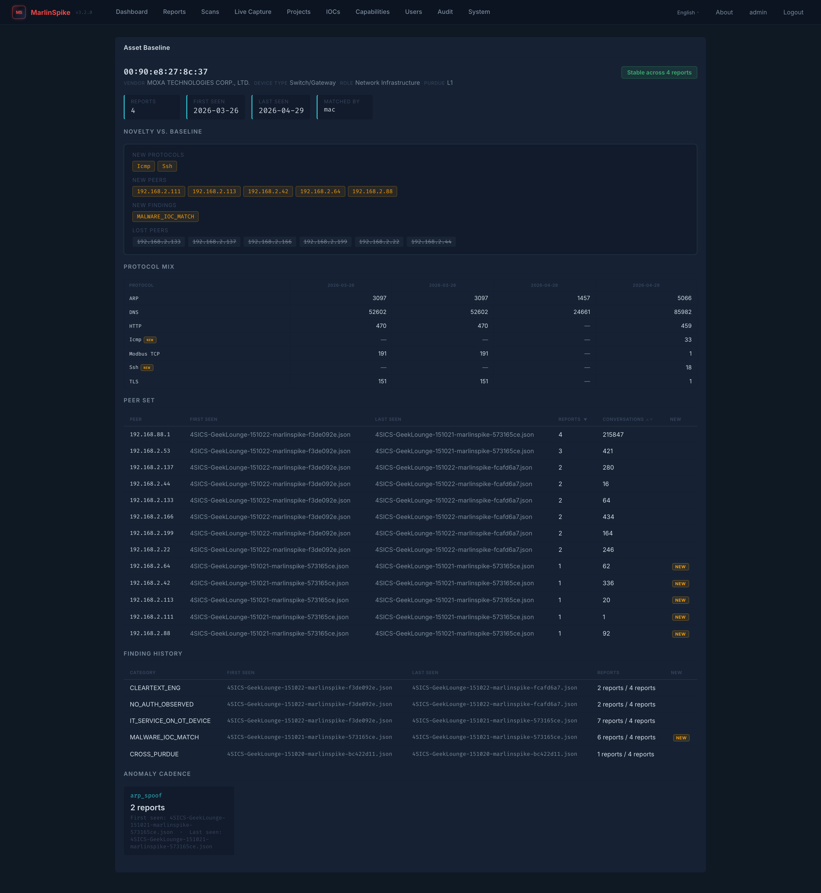
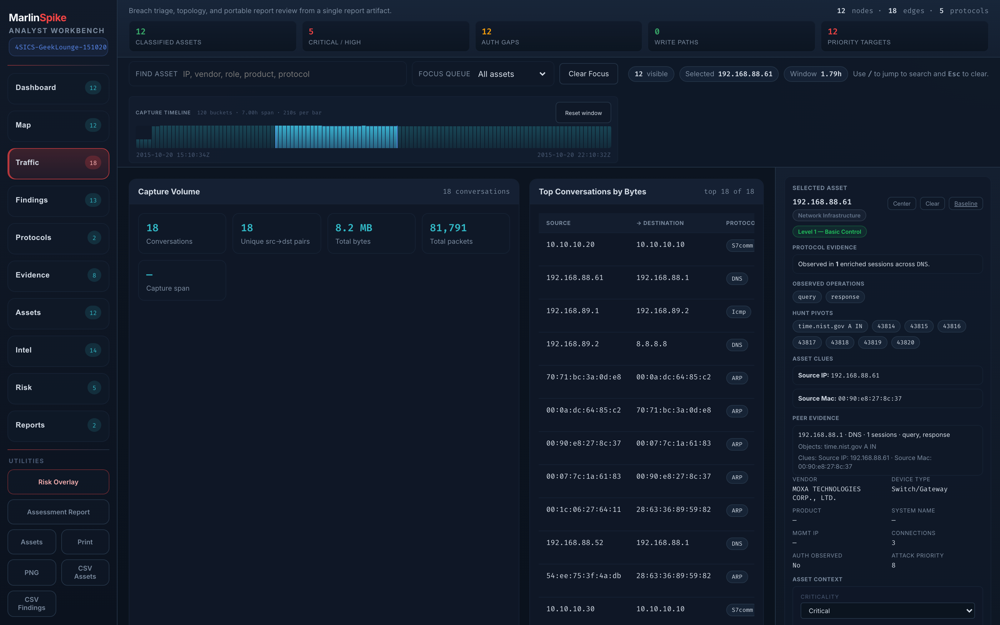
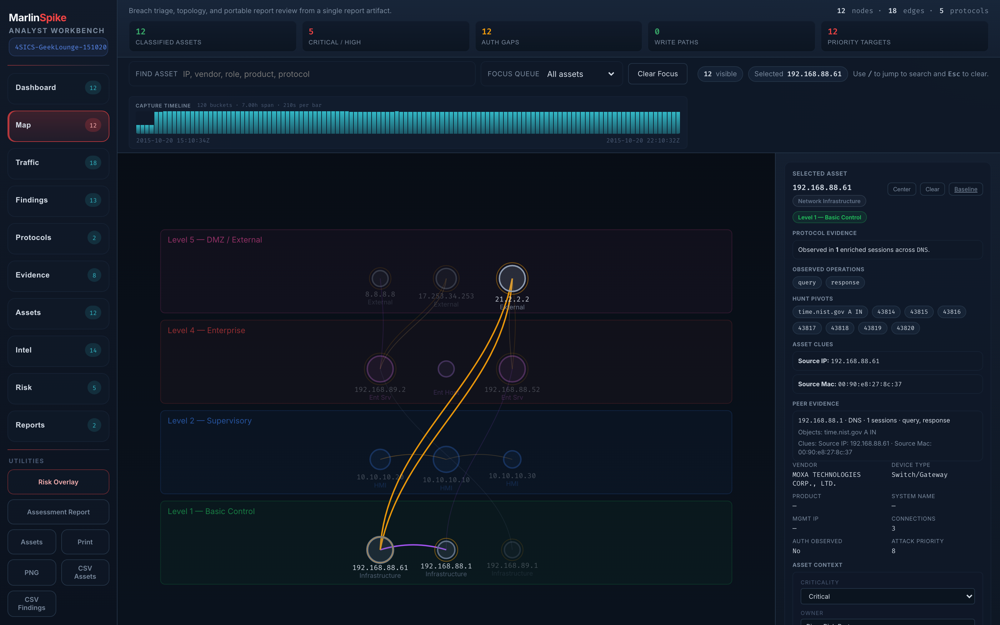
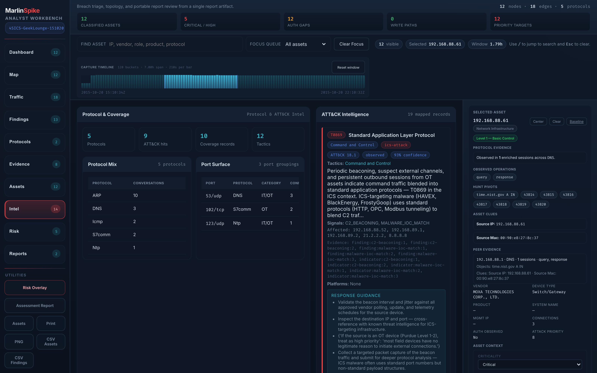

# MarlinSpike

Current release: `3.5.5`

MarlinSpike is a ground-up passive OT/ICS network analysis platform built in the tradition of GrassMarlin-style topology mapping, but wrapped in a multi-user web workbench designed for real engagements. It analyzes PCAP and PCAPNG captures, builds a topology graph, infers Purdue levels, fingerprints vendors, and surfaces responder-grade risk indicators such as cross-zone communication, cleartext services, beaconing, suspicious external communications, and DNS exfiltration, then exports everything as portable JSON report artifacts that travel with the team.


**Designed for on-site team engagements** — multi-user, zero-JS core workflows, `1 core / 1 GB RAM`, and portable JSON report artifacts.

**Bilingual workbench** (English / Français) — every screen flips between locales, including engine-emitted finding categories, descriptions, and remediations.

**2.45M packets (1.7 GB) -> 2,449 nodes, 2,662 edges, 75 findings in 58 seconds.**

Repository: [github.com/eris-ot/marlinspike](https://github.com/eris-ot/marlinspike)

## What MarlinSpike Is

MarlinSpike is not just a topology viewer and it is not just a packet parser.

It is a field-deployable analyst platform built around four ideas:

- Passive OT/ICS analysis first: capture files in, no packets sent back onto the network.
- Ground-up GrassMarlin-style replacement: modern topology reconstruction, protocol-aware classification, and analyst-friendly reporting without inheriting the old single-user desktop model.
- Multi-user workbench: projects, uploads, reports, history, administration, and a shared URL the whole engagement team can use at once.
- Portable report contract: the engine can run headlessly, produce report artifacts, and those artifacts can be reviewed in the built-in workbench or consumed elsewhere.

The result is a different operating model than a desktop analyzer. MarlinSpike is meant to be dropped onto a temporary engagement host, fed captures from taps, SPAN ports, or external collection, and used collaboratively during triage and assessment.

## Design Principles

MarlinSpike is built around a few practical constraints:

- The engine remains standalone and can produce report artifacts headlessly.
- The report artifact is the handoff between packet analysis and downstream review.
- The primary workflow is `project -> scan -> report -> workbench -> triage actions`.
- Core web workflows remain usable without client-side JavaScript.
- The codebase stays intentionally extensible for working OT/ICS responders, not just systems programmers.

Interactive browser features can improve speed and convenience, but the core triage experience should still be accessible directly from rendered HTML.

## Highlights

- Passive analysis only: no active scanning or packet transmission
- OT protocol parsing for Modbus, EtherNet/IP, S7, DNP3, PROFINET, OPC UA, BACnet, and more
- Expanded Rust DPI substrate via `marlinspike-dpi`: 34 protocol dissectors, Bronze v2 event output, frame-integrity inspection, ICMP anomaly inspection, and stateful L2 anomaly analysis; bilgepump `parse_anomaly` events are now consumed and surfaced as `l2_anomalies` in the report artifact, and per-packet ARP observations (`arp_observations`) are collected on the tshark path for downstream ARP-analysis plugins
- Topology construction with Purdue-level inference and vendor fingerprinting
- Risk surfacing for remote access exposure, C2-like beaconing, suspicious external channels, DNS entropy anomalies, policy violations, full MITRE ATT&CK mapping with tactics, sub-techniques, matrix views, response guidance, and IEC 62443 SR-oriented remediation guidance
- Flask web UI with an upgraded multi-mode analyst workbench, project management, report viewer, baseline/drift comparison, asset inventory, scan history, and a source-backed `/capabilities` detection coverage catalog
- Bilingual UI (English / Français) — Jinja chrome, JS-rendered workbench panes, and engine-emitted finding categories/descriptions/remediations all flip via a homegrown JSON-dictionary i18n layer with no new pip dependencies; locale picker in the nav, session-persisted, with `Accept-Language` fallback
- IR-triage workbench flow with two new left-rail panes that line up with the NetworkMiner / Arkime / Wireshark / Corelight / Dragos consensus pattern (provenance → inventory → traffic stats → protocol drilldown → anomalies/IOCs): **Traffic Statistics** pane (capture-volume KPIs, top conversations by bytes, protocol byte distribution, top source/destination endpoints, conversation-anomaly flags for beaconing / high-entropy DNS / unsecured OPC), and **Protocol Drilldown** pane (per-dissector evidence for Modbus, S7, DNP3, IEC 60870-5-104, CIP, MMS, GOOSE, BACnet, OMRON, PROFINET, OPC, DNS — with a roster header that lists silent families so absence of a protocol is itself part of the report)
- L2 / ARP anomaly surface in the workbench: bilgepump `mac_local` / `arp_spoof` / `mac_flap` detections grouped by anomaly type with per-bucket count, severity histogram, and representative samples; ARP observations rendered alongside
- Project Overview tab as the default project landing surface: walks every report in a project, dedupes assets (MAC-keyed, IP fallback) and findings (`(category, sorted(affected_nodes), sorted(affected_edges))`) across captures, promotes finding severity to the highest seen, and renders one rolled-up KPI strip, severity bar, findings table, asset inventory, protocol list, and ATT&CK coverage chip set — pure compute, no schema migration
- Pip-installable Python package (v3.0.0): `pip install marlinspike` exposes `from marlinspike import create_app, db`; downstream wrappers (e.g. cloudmarlin) can extend the app without forking via the new `csrf_exempt` and `set_concurrent_check_fn` extension hooks
- Optional **live capture** sidecar (`marlinspike-capd`, off by default, Linux only): unprivileged web app talks to a privileged daemon over a unix-domain socket; daemon supervises `dumpcap` with a 2 GB rolling ring, validates BPF filters live, enumerates physical NICs, and feeds rotated PCAPs into the existing analysis pipeline so reports accumulate in the project as the capture runs. Per-project saved-filter library, per-interface locking, admin-override stop. See [docs/live-capture.md](docs/live-capture.md)
- **Mid-scan recovery (v3.4.0):** Flask restarts no longer leave scans stuck in `running`. The engine subprocess is reparented to init/launchd and continues to completion; on the next boot, marlinspike's reaper finds it again via saved PID + argv (PID-reuse defense), re-attaches a watcher thread, and ingests the report when the engine exits. Dead engines whose reports finished get auto-completed; truly-dead engines surface as `failed` with a diagnostic `error_tail`. Optional `MARLINSPIKE_RUN_STORE=db` mode routes the active-run lookup through `scan_history` so per-tier concurrency limits stay correct across multiple Gunicorn workers. See [docs/run-store-and-recovery.md](docs/run-store-and-recovery.md)
- **Map-first workbench + multi-lens relational graphing (v3.5.0):** the analyst workbench was rebuilt around a persistent **map canvas** with a **lens chip strip** at the top, a **dockable inspector** on the right, and a **slide-up drawer** with seven tabbed tables (Findings / Conversations / Assets / IOCs / Anomalies / ATT&CK / DNS) at the bottom. Six lenses re-render the map with different edge types: Comms (host-host conversations), Findings (severity-sorted card overlay with click-to-pivot), IOC (matched-asset halos), ATT&CK (live tactic-grouped technique grid from the `marlinspike-mitre` plugin output, ICS + Enterprise domains), Baseline (per-asset novelty cards fetched from the project-level baseline endpoint), and Peers (Role / Vendor / Purdue grouping with anomalous-by-context flagging). All entity rendering derives from a formal taxonomy module (`marlinspike/taxonomy.py`, 12 entities + 12 relationships) — every chip, badge, table column, and tooltip on every page consumes the same source of truth. See [docs/taxonomy.md](docs/taxonomy.md) and [docs/workbench-guide.md](docs/workbench-guide.md)
- **HP-HMI mode (v3.5.0):** ISA-101 / ASM Consortium discipline applied app-wide. Toggle in the nav (or the workbench lens-strip control bar) flips the entire UI to the High-Performance HMI convention — color reserved for actionable abnormality only, equipment desaturates to gray, the eye is drawn directly to alarm-state assets. CRITICAL and HIGH severity stay loud; MEDIUM / LOW / INFO desaturate (informational, not actionable). The topology canvas re-renders in-place — normal-state assets fade, alarm-state assets retain alarm color. Particularly relevant for control-room wall-mount and dense-network triage. Persisted per-browser. See [docs/workbench-guide.md#hp-hmi-mode](docs/workbench-guide.md#hp-hmi-mode)
- Docker Compose deployment with PostgreSQL backing the application
- Rust DPI engine via [`marlinspike-dpi`](https://github.com/eris-ot/marlinspike-dpi) enabled by default (`--dpi-engine auto`), built into the image from a pinned GitHub ref — 14x faster than the Python tshark fallback on large captures
- MITRE ATT&CK runtime surfaces sourced from the standalone [`marlinspike-mitre`](https://github.com/eris-ot/marlinspike-mitre) repo at a pinned GitHub ref during image build
- Optional Stage 4b malware IOC runtime sourced from standalone `marlinspike-malware` and `marlinspike-malware-rules` repos when their build args are provided

## Quick Start

1. Clone the repository and enter the project directory.

```bash
git clone https://github.com/eris-ot/marlinspike.git
cd marlinspike
```

2. Copy the example environment file and set strong secrets.

```bash
cp .env.example .env
```

3. Build and start the stack.

```bash
docker compose up -d --build
```

4. Open the app at `http://127.0.0.1:5001` or through your reverse proxy.

On first boot, MarlinSpike creates an admin user. If `ADMIN_PASSWORD` is empty, a random password is generated and printed to the container logs.

See [INSTALL.md](INSTALL.md) for a generic deployment walkthrough.

## Documentation

The full docs index is at **[docs/README.md](docs/README.md)** — it
groups every document by intent (operator / admin / developer /
architecture / research) and tells you where to start based on
what you're trying to do.

The most-used entry points:

**Operator (analyst-facing)**

- [docs/triage-methodology.md](docs/triage-methodology.md) — the
  analyst loop, eight-step flow, read first.
- [docs/workbench-guide.md](docs/workbench-guide.md) — every pane
  in the report viewer.
- [docs/projects-and-engagements.md](docs/projects-and-engagements.md)
  — project model, Project Overview, multi-capture workflow.
- [docs/asset-context.md](docs/asset-context.md) — asset tagging,
  finding notes, contextual-severity overlay.
- [docs/asset-baselines.md](docs/asset-baselines.md) — per-asset
  longitudinal page, novelty-vs-baseline.
- [docs/time-scrubbing-and-extract.md](docs/time-scrubbing-and-extract.md)
  — time-window selection and sub-PCAP carve-out.
- [docs/ioc-threat-hunting.md](docs/ioc-threat-hunting.md) —
  `/iocs` page workflow.
- [docs/live-capture.md](docs/live-capture.md) — optional capd
  sidecar (Linux only).
- [docs/mitre-attack-guide.md](docs/mitre-attack-guide.md) — ATT&CK
  in the workbench.
- [docs/i18n-and-locale.md](docs/i18n-and-locale.md) — bilingual
  workflow (EN/FR).

**Admin / deployment**

- [INSTALL.md](INSTALL.md) — install, env vars, deployment modes.
- [docs/admin-and-audit.md](docs/admin-and-audit.md) — `/users`,
  `/audit`, password reset, session invalidation.
- [UPGRADING.md](UPGRADING.md) — version-to-version migration.

**Developer / integrator**

- [docs/cli-and-headless.md](docs/cli-and-headless.md) — running
  the engine without the web app.
- [docs/extensibility-contracts.md](docs/extensibility-contracts.md)
  — the three extension boundaries.
- [docs/bronze-consumer-contract.md](docs/bronze-consumer-contract.md)
  — DPI engine's Bronze event contract.
- [docs/msbundle-format.md](docs/msbundle-format.md) — proposed
  zipped bundle format.

**Architecture / direction**

- [COMPATIBILITY.md](COMPATIBILITY.md) — compatibility model,
  contract boundaries.
- [docs/repo-family.md](docs/repo-family.md) — suite + component
  repos model.
- [docs/analyst-workspace-roadmap.md](docs/analyst-workspace-roadmap.md)
  / [docs/defender-features-roadmap.md](docs/defender-features-roadmap.md)
  — product direction.

**Other**

- [CONTRIBUTING.md](CONTRIBUTING.md) — contribution workflow.
- [releases.md](releases.md) — release history.
- [presets/README.md](presets/README.md) — preset sample library.
- Component repos: [`plugins/marlinspike_mitre/`](plugins/marlinspike_mitre/),
  [`rules/mitre/base.yaml`](rules/mitre/base.yaml),
  [`scripts/sync-mitre-bootstrap.sh`](scripts/sync-mitre-bootstrap.sh),
  [`scripts/update-subtrees.sh`](scripts/update-subtrees.sh),
  [`scripts/sync-msengine-bootstrap.sh`](scripts/sync-msengine-bootstrap.sh).

The key extensibility terminology in this repository is:

- Rust engines: packet-facing and event-heavy components such as DPI
- Python plugins: report-facing analysis, enrichment, and triage logic
- YAML rule packs: declarative mappings, suppressions, and local policy

The key repo-family terminology is:

- `marlinspike`: suite repo that vendors selected component repos as subtree-based subrepos and can pin standalone build dependencies
- `marlinspike-msengine`: core engine repo, internal package and CLI name `msengine`
- `marlinspike-workbench`: web UI repo that can review reports with or without invoking the local engine
- `marlinspike-mitre`: standalone shared MITRE ATT&CK plugin repo consumed as a pinned build dependency for runtime plugin and rule surfaces
- `marlinspike-dpi`: standalone shared Rust DPI repo consumed as a pinned build dependency in the app image
- `marlinspike-malware`: standalone shared Rust IOC engine repo consumed as an optional pinned build dependency in the app image
- `marlinspike-malware-rules`: standalone shared rule-content repo consumed as an optional pinned build dependency for published IOC packs, manifests, and compiled bundle artifacts

The component repos are intended to be authoritative. The suite repo exists to pin and vendor a known-good combination for teams that want one clone with all updated parts.
The initial `msengine/` subtree prefix now exists in bootstrap form. Until full extraction completes, the root `_ms_engine.py` remains the operational engine source and [`scripts/sync-msengine-bootstrap.sh`](scripts/sync-msengine-bootstrap.sh) mirrors it into the subtree copy.
The current Docker build pins `marlinspike-dpi` to `326bdbb744a7b8f71295381fd209d9587dc09a3b` (release v1.7.0) by default via `MARLINSPIKE_DPI_REF`, `marlinspike-mitre` to `c3583ec2d189b8cde69f2160da6a5e8e5b643f7b` via `MARLINSPIKE_MITRE_REF`, `marlinspike-malware` to `02eb369c32e5050796c76be500c009dc0cb8940d` via `MARLINSPIKE_MALWARE_REF`, and `marlinspike-malware-rules` to `99cbe9358d0a5047d9b5e57a7e4ff5eafdee9bd4` via `MARLINSPIKE_MALWARE_RULES_REF`. On March 28, 2026, the rules ref was refreshed to a valid published commit and the malware repo was confirmed publicly readable at the pinned ref. Override those build args in your environment if you need a different known-good combination. The app prefers the published `packs/` surface over the engine repo's dev/test copy when discovering rules.

## ATT&CK Walkthrough

MarlinSpike now includes a full ATT&CK implementation in the report workflow,
including ATT&CK version metadata, tactic-grouped matrix views, sub-techniques,
mitigations, and response guidance.

See the user-facing walkthrough here:

- [docs/mitre-attack-guide.md](docs/mitre-attack-guide.md)

The guide includes screenshots and explains how to move between findings,
ATT&CK mappings, assets, and topology during triage.

## Positioning: Analyst Workbench vs Desktop Tool

MarlinSpike is not a general-purpose desktop analyzer. It is purpose-built as a temporary on-site analyst workbench for OT security engagements and assessments.

| Aspect | MarlinSpike (this project) | Typical desktop GRASSMARLIN-style tools |
|------|------|------|
| **Primary Use Case** | Spin up on an IPC or field laptop during a plant-floor engagement, review team-collected PCAPs, and hand back portable assessment artifacts | Solo deep-dive analysis on a single workstation |
| **User Model** | Multi-user, project-scoped workflow with auth, admin controls, and audit history | Usually single-user first |
| **Deployment** | Lightweight Docker Compose web app with zero-JS core workflows and a `1 core / 1 GB RAM` target | Desktop GUI application with heavier client-side runtime expectations |
| **Report Workflow** | PCAP from anywhere to self-contained JSON report artifacts, viewable here or consumable elsewhere, plus PDF/PNG/CSV exports | Tool-centric workflow with tighter coupling to the local application |
| **Operational Model** | Shared URL for the engagement team, fast setup and teardown, suitable for temporary or air-gapped field use | Persistent analyst desktop environment |
| **Extensibility** | Python analysis pipeline and HTML templates that are approachable for most security teams | Often centered on compiled desktop stacks with a steeper customization path |

In short:
Drop MarlinSpike on an air-gapped or temporary engagement host, hand the URL to the team, feed it the captures you collected, export clean portable JSON reports, and tear it down when the job is done.

If you are looking for a permanent single-user desktop application with a different feature focus, MarlinSpike is not trying to be that tool, and that is intentional.

## Feature Parity with GrassMarlin

MarlinSpike is meant to replace the core passive-mapping workflow people historically used GrassMarlin for, while changing the wrapper around it from a single-user desktop app to a shared web workbench.

| Capability | MarlinSpike status | Notes |
|------|------|------|
| Passive PCAP analysis | Yes | Accepts `pcap` and `pcapng` from the web UI or the standalone engine |
| OT-aware topology mapping | Yes | Relationship map, node/edge graph, vendor hints, and Purdue inference |
| Asset inventory | Yes | Per-asset roles, services, protocols, and responder-facing context |
| Protocol-aware OT analysis | Yes | Modbus, EtherNet/IP, S7, DNP3, PROFINET, OPC UA, BACnet, IEC 104, LLDP/CDP/STP/LACP, and more |
| Risk surfacing from passive traffic | Yes | Cleartext engineering, write-capable paths, suspicious external communications, beaconing, DNS exfiltration, and Purdue violations |
| Exportable outputs | Yes | Portable JSON report artifacts, plus PDF/PNG/CSV export paths from the UI |
| Team analyst workflow | Exceeds | Project-scoped collaboration, shared URL access, history, baseline/drift review, and admin controls are first-class instead of bolted on |
| Headless analysis contract | Exceeds | The engine can run independently, emit portable report artifacts, and be reviewed later in the workbench or elsewhere |
| Thick desktop client | Different by design | Replaced with a browser-based workbench and zero-JS core workflows for temporary, shared field deployment |

### Improving Actively

- Fingerprint depth and classification confidence across more vendors and device families
- Server-rendered analyst drill-down flows in the viewer
- Richer use of Bronze-level protocol observations and extracted artifacts in the report UI
- Broader protocol-native enrichment beyond the current report contract

### Honest Boundaries

- MarlinSpike is a **PCAP analysis tool**, not a continuous monitoring platform. Capture with your own tooling (Wireshark, tshark, a tap, a span port) and bring the PCAP into MarlinSpike for analysis. For continuous live capture, multi-sensor collection, and centralized OT network monitoring, see [FATHOM](https://github.com/eris-ot).
- MarlinSpike is not an active scanner.
- MarlinSpike is not a permanent desktop thick client.
- The standalone Rust DPI engine is a dissection substrate, not the whole product.
- Some protocol coverage and higher-level scoring still live in the Python analysis layer today, by design.

## Engine Architecture

MarlinSpike keeps packet dissection separate from analyst workflow.

### Current Analysis Stack

- Stage 1: capture ingestion and validation
- Stage 2: protocol dissection
- Stage 3: topology construction, Purdue inference, and fingerprinting
- Stage 4: breach-triage and risk surfacing
- Output: portable JSON report artifact consumed by the web workbench

### DPI Engine Options

MarlinSpike can currently run Stage 2 in two ways:

- Built-in Python/tshark-based dissection via `_ms_engine.py`
- External Rust dissection via [`marlinspike-dpi`](https://github.com/eris-ot/marlinspike-dpi)

The Rust path is intentionally scoped as a standalone DPI engine. MarlinSpike can call it as an external Stage 2 parser, adapt its Bronze output back into the current report pipeline, and continue using the existing topology, triage, and reporting layers. That keeps the packet parser reusable without forcing the analyst product to collapse into the parser.

### What `marlinspike-dpi` Means Today

- It is a standalone Rust DPI engine with CLI, library, and FFI surfaces.
- It accepts classic `pcap` and `pcapng` capture input.
- It currently ships 34 protocol dissectors across OT/ICS, IT, and L2 traffic.
- It emits Bronze v2 events that MarlinSpike can consume across five families: protocol transactions, asset observations, topology observations, parse anomalies, and extracted artifacts.
- It layers additional parser-adjacent inspection through `stovetop` frame integrity checks, `icmpeeker` ICMP anomaly analysis, and `bilgepump` stateful L2 anomaly tracking.
- It replaces the dissection stage, not the higher-level breach-triage logic.

That is deliberate. MarlinSpike's value is not just decoding packets quickly. Its value is turning passive OT traffic into topology, findings, and responder decisions a team can actually use.

### Extensibility Model

MarlinSpike uses three extension surfaces on purpose:

- Rust engines: packet-facing or event-heavy components where throughput, memory safety, and parser reuse matter most. Today this primarily means DPI-style engines such as [`marlinspike-dpi`](https://github.com/eris-ot/marlinspike-dpi).
- Python plugins: report-facing analysis, enrichment, triage logic, and post-processing that operate on the portable MarlinSpike JSON artifact rather than raw packets.
- YAML rule packs: declarative mappings, enable/disable controls, site overrides, and other policy content used by plugins without turning configuration into another programming language.

In short:

- Rust finds facts in raw traffic.
- Python turns those facts into responder-facing judgments.
- YAML declares mappings and local policy.

This split is intentional. MarlinSpike is not written as "Rust for everything" because the primary app is meant to be easy to extend by the broader OT/ICS community, including responders, defenders, and consultants who may need to adjust logic during an active remediation event. Rust is excellent for memory-safe, reusable packet engines. Python remains a better fit for fast iteration, site-specific extension, and field-friendly report logic when a team is actively triaging an environment.

Current shipped example:

- `marlinspike-mitre`: authoritative sister repo at `marlinspike-mitre`, with the app image now overlaying the runtime plugin and rule surfaces from the pinned standalone repo into [`plugins/marlinspike_mitre/`](plugins/marlinspike_mitre/) and [`rules/mitre/base.yaml`](rules/mitre/base.yaml) during build. Successful scans can emit a `-mitre.json` sidecar artifact, and the workbench viewer can load it from the report `extensions` surface.
  The current runtime exposes full ATT&CK metadata and versioning, tactics, sub-techniques, matrix-ready tactic groupings, mitigations, ATT&CK URLs, and rich response guidance in the viewer.
  User-facing interpretation notes live in [docs/mitre-attack-guide.md](docs/mitre-attack-guide.md).
- `marlinspike-malware`: authoritative sister repo at `marlinspike-malware`, with `_ms_engine.py` invoking it as an optional Stage 4b engine. When `MARLINSPIKE_MALWARE_REPO` and `MARLINSPIKE_MALWARE_REF` are supplied during image build, the runtime binary is layered into `/opt/marlinspike-malware/bin/`.
- `marlinspike-malware-rules`: authoritative sister repo at `marlinspike-malware-rules`, holding the published `packs/`, `manifests/index.yaml`, and compiled bundle artifacts. The current published surface is 30 packs and 921 rules. When `MARLINSPIKE_MALWARE_RULES_REPO` and `MARLINSPIKE_MALWARE_RULES_REF` are supplied during image build, those assets are layered into `/usr/share/marlinspike-malware/rules/`, and the engine points at `/usr/share/marlinspike-malware/rules/packs`.

See [`docs/extensibility-contracts.md`](docs/extensibility-contracts.md) for the concrete contract boundaries for Rust engines, Python plugins, and YAML rule packs.

If you are deciding where new work belongs, use this rule of thumb:

- If it consumes raw `pcap`, packet streams, or high-volume protocol events, it probably belongs in a Rust engine.
- If it consumes the finished MarlinSpike report artifact, it probably belongs in a Python plugin.
- If analysts should be able to tune it without code changes, it probably belongs in a YAML rule pack.

## Detection and Standards Coverage

MarlinSpike's current public detection and standards story is intentionally bounded to what the engine already emits today.

- Full MITRE ATT&CK implementation is now present through the shared `marlinspike-mitre` runtime, including ATT&CK version metadata, tactic-aware matrix output, sub-techniques, parent-technique context, mitigations, and response guidance
- `marlinspike-dpi` now contributes a broader passive-observable surface: 34 protocol dissectors, Bronze v2 event families, and parser-adjacent anomaly streams from `stovetop`, `icmpeeker`, and `bilgepump`
- Purdue Model inference and cross-level communication checks are part of the core triage workflow
- Stage 4 remediation guidance is aligned to IEC 62443 SR requirements for the finding classes currently produced by the engine
- Deployed instances publish a built-in detection coverage catalog at `/capabilities` that is explicitly framed as what MarlinSpike can detect, not what it has already detected in a given environment
- The `/capabilities` page now groups current report finding classes, `marlinspike-dpi` parser coverage, `marlinspike-malware` observable and rule coverage, and the current ATT&CK mapping set behind filterable source, type, family, severity, and search controls
- The current `marlinspike-malware` section reflects the published `marlinspike-malware-rules` content surface, now at 30 packs and 921 rules, and the ATT&CK section reflects the vendored full ATT&CK implementation shipped by `marlinspike-mitre`

This is now positioned as a full ATT&CK implementation for MarlinSpike's report-facing workflow. It is still intentionally scoped to passive-traffic evidence and analyst triage rather than a broader compliance crosswalk or every possible ATT&CK analytic.

## Feature Overview

MarlinSpike turns raw packet captures into a workflow an OT operator, asset owner, or responder can actually use.

### Analysis

- Passive PCAP and PCAPNG analysis with OT-aware protocol dissection
- Relationship map and topology reconstruction with Purdue inference
- Report-driven triage with risk findings, C2 indicators, and asset context
- Detailed asset inventory, service exposure, conversation analysis, and MAC table reporting

### Workflow

- Ad hoc scan execution from the web UI
- Multi-capture handling, including large-PCAP processing with streaming progress
- Project-scoped organization for captures and reports
- Project Overview tab as the default project landing surface — cross-report aggregation across every capture in the project (asset dedup, finding dedup with severity promotion, protocol roll-up, ATT&CK coverage)
- Report history, retry support, and baseline-versus-drift review between report artifacts
- Portable JSON report artifacts that can be reviewed inside MarlinSpike or elsewhere

### Administration

- Multi-user access with admin controls
- Scan history and audit trail
- System health and monitoring views
- Sample library management

## Export Support

The report workflow supports export directly from the UI:

- Print or save to PDF from the report viewer
- PNG export from the topology viewer
- CSV export from the asset inventory view

## Project Overview — Cross-Report Aggregation

Most engagements produce more than one capture. A site might be captured every day for a week, or different switches might be tapped on the same day, or the same PCAP might be re-run after a rules change. MarlinSpike used to expose those as separate report artifacts side by side; the analyst had to mentally collapse them.

The Project Overview tab does that collapse for you and is the default surface when you open a project.

What it does:

- Walks every report in the project (engine reports plus any plugin sidecars surfaced through the existing extensions bridge — APT, ARP, MITRE).
- Dedupes assets by MAC first and IP second. Each asset record carries `first_seen_report` / `last_seen_report` and a `report_count`.
- Dedupes findings by `(category, sorted(affected_nodes), sorted(affected_edges))`. Severity promotes to the highest seen across reports; the latest report wins for the description text. Each finding shows occurrence count as `seen in N of M reports`.
- Rolls up protocols and ATT&CK technique coverage across reports.
- Renders one KPI strip, one severity distribution bar, one findings table sorted by severity then occurrence count, one asset inventory with a sticky filter toolbar, one protocol distribution chip set, and one ATT&CK coverage chip set.

What it is not:

- Not a database migration. Aggregation is pure compute over the on-disk JSON report artifacts and runs each time the tab is opened. There is no schema change, no extra storage, and no background job.
- Not a replacement for the per-report viewer. The per-report MITRE matrix, evidence pivots, baseline/drift, and report-level export paths still live on the report itself. Use Overview for "what does this engagement look like overall," and use a specific report for "what happened in this capture."

The aggregation API is exposed at `/api/projects/<id>/aggregate` for tooling that wants to consume the same roll-up without rendering the tab. Per the v2.4.0 release notes the aggregator is unit-tested across per-report dedup, cross-report dedup, severity promotion, IP-fallback keys, ATT&CK rollup, scan-profile breakdown, and loader failure isolation; a Playwright smoke covers the full login → project select → Overview render → KPI / severity bar / findings sort / asset filter / tab cycling path.

## Additional Capabilities

- Baseline and drift review with added, removed, changed, and unchanged topology comparison
- Live topology viewing during active scans
- Scan-stage progress streaming with ingest, analyze, classify, and report state visibility
- Per-user administration controls including password resets and upload limits
- Multi-report lifecycle actions including view, download, delete, and compare
- Retry of failed or interrupted scans from scan history
- Sample library administration with category management and PCAP upload/delete controls
- Capture filter input and ephemeral-port suppression controls in the scan workflow
- MAC table reporting alongside the main assessment view

## Screenshots

Click any thumbnail for the full-size image.

### Project Overview (cross-report aggregation)

The Project Overview tab is the default project landing surface. It rolls every report in the project up into one view: KPIs, severity distribution, deduped findings sorted by severity then occurrence count, and an asset inventory with a sticky filter toolbar. The severity bar shows distribution at a glance with inline counts, and the findings table tracks how many of the project's reports each distinct finding showed up in (`SEEN IN` column). Asset and finding records are MAC-keyed by default with an IP fallback and carry first/last-seen-in-report attribution.

This screenshot was captured against the 4SICS benchmark project after running three days of `4SICS-GeekLounge` captures (`151020`, `151021`, `151022`) and one re-run of the `151022` day, for four reports total. The aggregator deduped 119 finding occurrences down to 96 distinct findings and 48 unique assets across the four captures.

<table>
  <tr>
    <td width="100%">
      <a href="docs/screenshots/28-project-overview-multiday.png">
        
      </a>
      <br>
      <sub>Project Overview after rolling up four 4SICS reports — 4 reports, 48 unique assets, 96 distinct findings, 15 protocols, 2 ATT&CK techniques mapped. Findings table shows occurrence counts as `seen in N of M` and is sorted by severity then occurrences.</sub>
    </td>
  </tr>
</table>

### v3.x Workflow Surfaces

The features added across v3.0 → v3.3, captured against a 4-report 4SICS engagement. Each links to its operator guide.

<table>
  <tr>
    <td width="50%">
      <a href="docs/screenshots/29-capture-page.png">
        
      </a>
      <br>
      <sub><strong>Live Capture (<a href="docs/live-capture.md">guide</a>)</strong> — optional <code>marlinspike-capd</code> sidecar daemon (Linux only). Enumerates physical NICs, validates BPF against the active interface's DLT, supervises <code>dumpcap</code> with a 2 GB rolling ring, and feeds rotated PCAPs into the existing analysis pipeline. Per-project saved-filter library, per-interface locking, admin-override stop.</sub>
    </td>
    <td width="50%">
      <a href="docs/screenshots/30-iocs-page.png">
        
      </a>
      <br>
      <sub><strong>IOC Threat-Hunting (<a href="docs/ioc-threat-hunting.md">guide</a>)</strong> — per-project IOC lists with bulk-paste import (auto-detects IPv4/v6, MAC, OUI, sha256, md5, domain). Cross-report scan walks every report in the project and matches against nodes, conversations, c2_indicators, risk_findings, dns_queries, and malware_findings.</sub>
    </td>
  </tr>
  <tr>
    <td width="50%">
      <a href="docs/screenshots/46-ioc-scan-hits.png">
        
      </a>
      <br>
      <sub><strong>IOC scan results</strong> — cross-report hit table with match surface (node / conversation / c2_indicator), report attribution, severity, and label. Capped at 1000 hits per scan.</sub>
    </td>
    <td width="50%">
      <a href="docs/screenshots/44-asset-baseline.png">
        
      </a>
      <br>
      <sub><strong>Per-asset baselines (<a href="docs/asset-baselines.md">guide</a>)</strong> — longitudinal profile across every report in a project for one asset. Identity drift detection on vendor / role / device-type, protocol-mix history, peer first-seen / last-seen attribution, finding cadence buckets, anomaly cadence, and the headline novelty-vs-baseline card flagging what's new in the latest capture.</sub>
    </td>
  </tr>
  <tr>
    <td width="50%">
      <a href="docs/screenshots/47-time-scrubber-window.png">
        
      </a>
      <br>
      <sub><strong>Time-window scrubbing + sub-PCAP extract (<a href="docs/time-scrubbing-and-extract.md">guide</a>)</strong> — adaptive packet-rate histogram below the workbench toolbar. Drag to select a window; every conversation-driven pane filters live. Per-conversation Extract button carves out a sub-PCAP scoped to the window for Wireshark-level inspection.</sub>
    </td>
    <td width="50%">
      <a href="docs/screenshots/45-workbench-selected-asset.png">
        
      </a>
      <br>
      <sub><strong>Asset context (<a href="docs/asset-context.md">guide</a>)</strong> — site-specific tagging (owner, criticality, zone, business function) drives a contextual-severity overlay on findings. Tagging an asset <code>critical</code> bumps every finding touching it one tier; tagging <code>low</code> drops all-low findings one tier.</sub>
    </td>
  </tr>
  <tr>
    <td width="50%">
      <a href="docs/screenshots/31-audit-page.png">
        
      </a>
      <br>
      <sub><strong>Audit log (<a href="docs/admin-and-audit.md">guide</a>)</strong> — admin-only view of every <code>auth.*</code> and <code>capture.*</code> event the app emits. Filters by event type, username, status. Color-coded success / failure pills. Tracks actor user + role + IP at time of event.</sub>
    </td>
    <td width="50%">
      <a href="docs/screenshots/43-workbench-intel.png">
        
      </a>
      <br>
      <sub><strong>Workbench Intel mode (<a href="docs/workbench-guide.md#intel">guide</a>)</strong> — protocol coverage chips, ATT&CK technique detail with response guidance and IEC 62443 alignment, per-tactic detection coverage. Both Enterprise ATT&CK and ICS ATT&CK are loaded.</sub>
    </td>
  </tr>
</table>

### Live Workflow Validation

These screenshots come from a live end-to-end smoke pass captured on March 28, 2026 against the current hosted deployment after running three preset PCAPs: `Modbus.pcap`, `S7comm.pcap`, and the 4SICS benchmark in `fast` mode. They show the core responder path from `project -> scan -> report -> workbench -> assets`.

<table>
  <tr>
    <td width="50%">
      <a href="docs/screenshots/22-live-dashboard.png">
        
      </a>
      <br>
      <sub>Dashboard with the scan workspace surfaced as the operational starting point.</sub>
    </td>
    <td width="50%">
      <a href="docs/screenshots/23-live-projects.png">
        
      </a>
      <br>
      <sub>Project-scoped workspace showing the engagement container used to keep the smoke outputs isolated.</sub>
    </td>
  </tr>
  <tr>
    <td width="50%">
      <a href="docs/screenshots/24-live-scans.png">
        
      </a>
      <br>
      <sub>Scan history with multiple completed runs, including the large-PCAP benchmark path.</sub>
    </td>
    <td width="50%">
      <a href="docs/screenshots/25-live-benchmark-viewer.png">
        
      </a>
      <br>
      <sub>The operator shell on the 4SICS benchmark report with priority targets, auth gaps, and write paths in view.</sub>
    </td>
  </tr>
  <tr>
    <td width="50%">
      <a href="docs/screenshots/26-live-modbus-viewer.png">
        
      </a>
      <br>
      <sub>A smaller protocol-specific validation pass against Modbus showing the same workbench flow on a focused OT capture.</sub>
    </td>
    <td width="50%">
      <a href="docs/screenshots/27-live-assets.png">
        
      </a>
      <br>
      <sub>Assets mode turns the validated report into a sortable responder ledger with device context and risk evidence.</sub>
    </td>
  </tr>
</table>

<table>
  <tr>
    <td width="50%">
      <a href="docs/screenshots/01-topology-viewer.png">
        
      </a>
      <br>
      <sub>Topology viewer and analyst workbench</sub>
    </td>
    <td width="50%">
      <a href="docs/screenshots/02-report-viewer.png">
        
      </a>
      <br>
      <sub>Assessment findings and report review</sub>
    </td>
  </tr>
  <tr>
    <td width="50%">
      <a href="docs/screenshots/03-asset-inventory.png">
        
      </a>
      <br>
      <sub>Asset inventory and device context</sub>
    </td>
    <td width="50%">
      <a href="docs/screenshots/06-large-pcap-streaming.png">
        
      </a>
      <br>
      <sub>Large-PCAP execution with live progress</sub>
    </td>
  </tr>
  <tr>
    <td width="50%">
      <a href="docs/screenshots/07-scan-history.png">
        
      </a>
      <br>
      <sub>Scan history and audit trail</sub>
    </td>
    <td width="50%">
      <a href="docs/screenshots/08-projects.png">
        
      </a>
      <br>
      <sub>Project-scoped workflow</sub>
    </td>
  </tr>
  <tr>
    <td width="50%">
      <a href="docs/screenshots/09-users.png">
        
      </a>
      <br>
      <sub>Multi-user administration</sub>
    </td>
    <td width="50%">
      <a href="docs/screenshots/11-diff-viewer.png">
        
      </a>
      <br>
      <sub>Baseline and drift review</sub>
    </td>
  </tr>
</table>

### Upgraded Analyst Workbench

The analyst workbench is now structured as a full operator shell instead of a single crowded viewer. A persistent left rail carries workbench identity, report context, mode navigation, and utilities, while the center stage and right-side inspector stay focused on active triage work.

The current shell supports `Dashboard`, `Map`, `Findings`, `Evidence`, `Assets`, `Intel`, `Risk`, and `Reports` surfaces without trying to cram every workflow into the topology canvas.

This screenshot comes from a live validated report artifact after the public `marlinspike-dpi` update and shows the denser operator shell now used by the viewer.

<table>
  <tr>
    <td width="100%">
      <a href="docs/screenshots/21-workbench-operator-shell.png">
        
      </a>
      <br>
      <sub>The operator shell uses a full-height navigation rail, compact status strip, single-row command bar, and persistent inspector so the first viewport stays focused on responder work.</sub>
    </td>
  </tr>
</table>

Additional screenshots show the mode-based workbench surfaces in detail.

<table>
  <tr>
    <td width="33%">
      <a href="docs/screenshots/18-workbench-evidence-mode.png">
        
      </a>
      <br>
      <sub>Evidence mode surfaces enriched sessions, identity clues, hunt pivots, and preserved DPI observables.</sub>
    </td>
    <td width="33%">
      <a href="docs/screenshots/19-workbench-findings-mode.png">
        
      </a>
      <br>
      <sub>Findings mode gives responders a dedicated triage surface instead of forcing everything into the map.</sub>
    </td>
    <td width="33%">
      <a href="docs/screenshots/20-workbench-assets-mode.png">
        
      </a>
      <br>
      <sub>Assets mode turns the workbench into a searchable ledger with evidence density and asset context.</sub>
    </td>
  </tr>
</table>

The older live screenshots are still useful as protocol-specific validation examples:

<table>
  <tr>
    <td width="33%">
      <a href="docs/screenshots/15-live-workbench-mqtt.png">
        
      </a>
      <br>
      <sub>Live MQTT workbench with preserved client, topic, and asset enrichment.</sub>
    </td>
    <td width="33%">
      <a href="docs/screenshots/16-live-workbench-radius.png">
        
      </a>
      <br>
      <sub>Live RADIUS workbench with auth metadata, object refs, and triage context.</sub>
    </td>
    <td width="33%">
      <a href="docs/screenshots/17-live-workbench-ftp.png">
        
      </a>
      <br>
      <sub>Live FTP workbench after the public parser panic fix shipped to production.</sub>
    </td>
  </tr>
</table>

## Configuration

The main environment variables are:

- `DB_PASSWORD`: PostgreSQL password
- `SECRET_KEY`: Flask session secret
- `ADMIN_PASSWORD`: initial admin password
- `PCAP_MAX_SIZE`: maximum accepted upload size in bytes (default: 5 GB)
- `MARLINSPIKE_DPI_ENGINE`: DPI engine selection — `auto` (default, uses Rust when available), `marlinspike-dpi`, or `python`
- `MARLINSPIKE_DPI_BIN`: path to `marlinspike-dpi` binary (default: auto-detected from PATH)

## Source Layout

The canonical application modules are:

- `_ms_engine.py`
- `_auth.py`
- `_models.py`
- `_config.py`
- `app.py`

The non-underscored modules (`auth.py`, `models.py`, `config.py`) are compatibility shims so older tooling can still import them without drifting from the real source.

## Sample Data

The public repository does not bundle third-party PCAP corpora. If you want a preset sample library, add captures under `presets/<category>/` locally or through the admin UI after deployment.

## Development

- `python3 -m py_compile app.py _auth.py _config.py _models.py _ms_engine.py`
- `docker compose up --build`

See [CONTRIBUTING.md](CONTRIBUTING.md) for contribution guidelines, including ongoing fingerprinting and enrichment work.

## Fathom

MarlinSpike is the open-source core of **Fathom**, the commercial OT security platform from [Erisforge Ltd.](https://github.com/eris-ot/marlinspike).

The commercial Fathom platform adds distributed collectors, hierarchy, data diodes, forensic time-travel, and enterprise-scale baseline learning. MarlinSpike is the lightweight, open-core workbench you can spin up anywhere.

Learn more at [github.com/eris-ot/marlinspike](https://github.com/eris-ot/marlinspike).

## Acknowledgments

MarlinSpike is better because of the people who take the time to test it, read the code, and file issues or PRs. Community contributors:

- **[Michael Sargis (@MichaelMVS)](https://github.com/MichaelMVS)** — caught a silent OUI dict collision in `ICS_OUI_DB` that was causing Honeywell devices to be misidentified as GE in every report ([PR #3](https://github.com/eris-ot/marlinspike/pull/3), v2.0.3)
- **Jerrid Brown** (OTPulse) — ran real DCS packet captures through MarlinSpike and surfaced multiple classification and UX issues that drove the v2.0.1 / v2.0.2 fixes (multicast misclassification, OUI gateway-MAC misattribution, NO_AUTH_OBSERVED noise, Level 3 "Application Server" catch-all, Purdue L3 vs L4 heuristics)

If you find a bug or have a fingerprint to add, [open an issue](https://github.com/eris-ot/marlinspike/issues) or [send a PR](https://github.com/eris-ot/marlinspike/pulls) — first-time contributors very welcome.

## License

This repository is licensed under the GNU Affero General Public License v3.0. See [LICENSE](LICENSE).

## Contact

Questions? Open an issue at [github.com/eris-ot/marlinspike/issues](https://github.com/eris-ot/marlinspike/issues).
