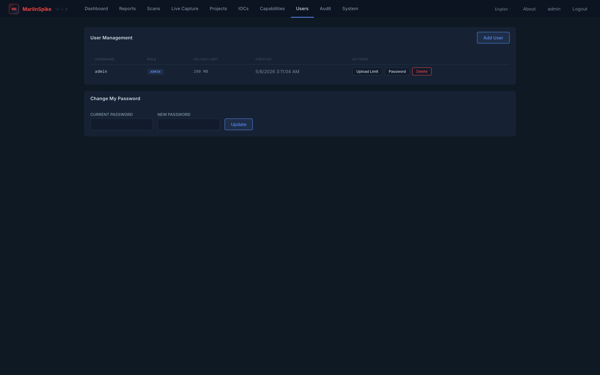
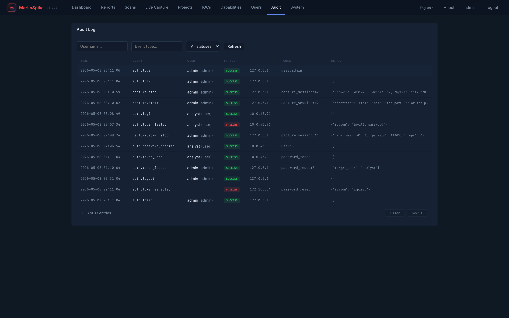
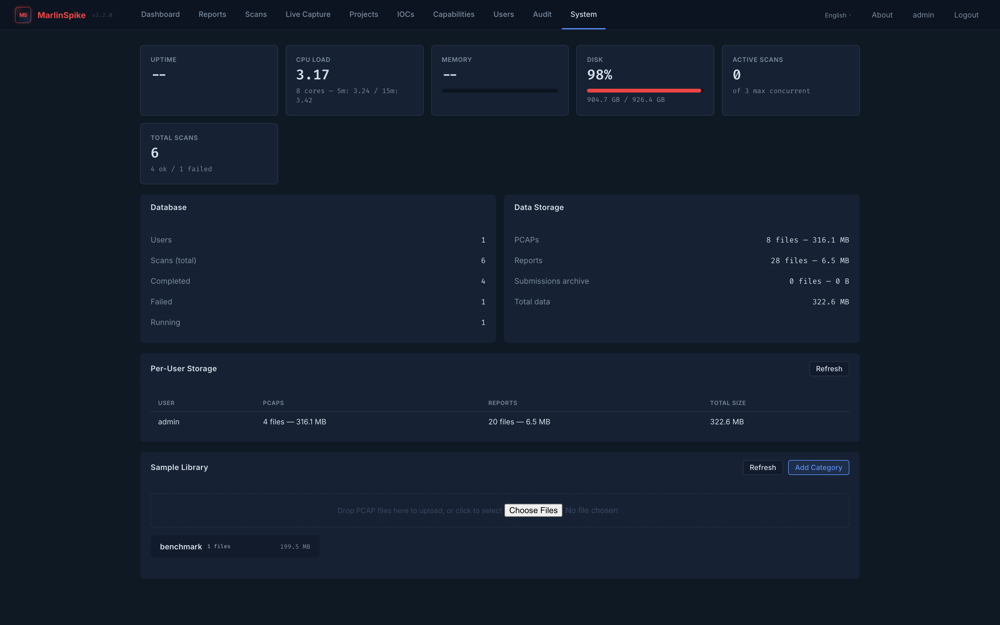

# Admin & Audit

Admin features in MarlinSpike are **deliberately small**. The
project is meant to be operated by a security team, not a product
ops team. The admin surfaces are:

- `/users` — user management (create, edit, delete, change limits).
- `/audit` — auth-event audit log viewer.
- `/system` — runtime info (versions, disk usage, scan registry).
- Admin override on capture sessions (stop any user's session).

This doc covers each surface, the access model, the audit log
contents, and the password-reset flow.

---

## Roles

Two roles, set on the `users.role` column:

| role | what it can do |
|---|---|
| `user` | own projects, own reports, own scans, own asset tags / notes / IOCs / capture sessions. Can see and use the workbench, /capabilities, /capture, /iocs. |
| `admin` | everything `user` can do, plus: `/users`, `/audit`, `/system`, stop any user's capture session, list-all capture sessions via `?all=1`. |

There's no `viewer` / `read-only` / `analyst` role today. If you
need fine-grained access, the model to use is one MarlinSpike
instance per access boundary (per-engagement, per-team).

---

## /users



`/users` (admin-only) shows every user with:

| column | content |
|---|---|
| Username | login |
| Role | `user` / `admin` |
| Email | optional |
| Upload Limit | per-user MB cap on PCAP uploads (default 200) |
| Scans | total scans this user has started |
| Projects | total projects this user owns |
| Created | account creation timestamp |
| Actions | edit limit, change password, delete |

### Adding a user

**+ Add user** at the top opens a modal with username, password,
role. Password is hashed (PBKDF2-SHA256 via Werkzeug) before
write. Username uniqueness is enforced.

### Per-user upload limits

The Upload Limit column is editable inline. Saves immediately to
`POST /api/users/<username>/limits`. The new limit applies to all
future uploads from that user; in-flight uploads complete using
the limit at request time.

There's no per-project limit, no global cap separate from
`PCAP_MAX_SIZE` / `PCAP_PROCESS_SIZE`.

### Changing a user's password

Admin → user row → **Change password** → modal. Two paths:

- **Generate** — server generates a 16-char random password and
  shows it once. Copy and hand to the user out-of-band.
- **Set** — admin types the new password.

Either path bumps `users.session_version`, which invalidates every
existing session for that user. They must log in again with the
new password.

Self-service password change happens at `/profile` (the user's own
account); admins use this modal for *other* users.

### Deleting a user

Admin → user row → **Delete**. Cascades:

- Projects (via `users.id` FK with `ON DELETE CASCADE`).
- Reports / PCAPs / scan history → cascade through projects.
- Asset tags / finding notes / IOC lists / capture sessions →
  cascade.
- Audit log entries → **NOT cascaded**. Audit entries reference
  `actor_user_id` directly without a FK constraint. The user is
  gone, but their audit trail persists.

You can't delete yourself. The first/last admin protection is at
the application layer — the route refuses if the deletion would
leave zero admins.

---

## /audit



The audit log viewer, admin-only. Paginated table of every audit
event the app emits.

### What gets logged

| event_type | category | when |
|---|---|---|
| `auth.login` | auth | every successful login |
| `auth.login_failed` | auth | every failed login |
| `auth.logout` | auth | every logout |
| `auth.token_issued` | auth | password reset token issued |
| `auth.token_used` | auth | reset token redeemed for password change |
| `auth.token_rejected` | auth | invalid / expired / reused reset token |
| `auth.password_changed` | auth | self-serve password change |
| `auth.admin_password_changed` | auth | admin changed someone else's password |
| `capture.start` | capture | live-capture session started |
| `capture.stop` | capture | live-capture session stopped by owner |
| `capture.admin_stop` | capture | live-capture session stopped by admin override |

Each row carries:

- `event_type`, `category`, `status` (`success` / `failure`)
- Actor: `actor_user_id`, `actor_username`, `actor_role` at
  time-of-event
- Target: `target_type`, `target_id` (e.g.
  `target_type=capture_session, target_id=42`)
- `ip_address` from `request.remote_addr`
- `detail` — JSON blob with event-specific context
- `created_at` — UTC

Audit writes are **best-effort by design**: `audit()` swallows
exceptions and rolls back so audit logging can never break normal
operations. If a write fails (e.g. the audit table is locked),
the app keeps serving requests; the loss surfaces in app logs at
WARNING level.

### Filtering

The page header has filter inputs:

- **Event type** — substring match on `event_type`.
- **Username** — substring match on `actor_username`. Empty matches
  all (debounced).
- **Status** — dropdown: All / Success / Failure.

Pagination via Prev / Next at the bottom; page size defaults to
50, configurable via `?limit=` query param.

### What's NOT logged

- Read access (no `report.viewed`, no `assets.listed`, etc.). The
  audit log is **auth + state-change** focused.
- Asset tag / finding note / IOC list mutations. These are
  user-scoped and triage-internal; we judged the noise wasn't
  worth the value. (Considering for v3.4.0.)
- Project creation / deletion. (Same reasoning.)
- Scan starts / stops. The scan history table is the audit trail
  for scans.

Capture sessions are an exception because they hold network
capabilities and warrant the same treatment as auth.

### Retention

Indefinite by default. The audit log table grows linearly with
event volume. On a multi-user instance with active live capture,
expect roughly 100-1000 events per user per day.

There's no built-in retention policy. If you need one, run a
periodic `DELETE FROM audit_log WHERE created_at < NOW() -
INTERVAL '180 days'` from cron or your orchestration.

---

## /system (admin)



Runtime info dashboard:

- **App version** + **engine version** (the two are independent;
  see [releases.md](../releases.md) for the why).
- **DPI engine** info — `auto` / `python` / `marlinspike-dpi`,
  binary path, last-detected version.
- **MITRE rule packs** loaded and their versions.
- **APT / ARP / malware plugin** enable status and rule pack
  versions.
- **Disk usage** — reports dir, uploads dir, total free space.
- **Active scan registry** — scans currently running (run_id,
  user, project, command, started_at, current stage).
- **Active capture sessions** — list-all view. Stop affordance
  per session.

Admin-only. Useful as the "what's actually happening on this
host right now" dashboard during an engagement.

---

## Password reset flow

The flow is token-based, single-use, IP-logged. Reset tokens live
in `password_reset_tokens` with a 30-minute TTL.

### Triggering a reset

Two ways to issue a reset token:

1. **User-initiated** at `/login` → "Forgot password?" → enter
   username → `POST /api/auth/reset-request`. Logs to audit as
   `auth.token_issued`. The token value is shown to the user
   (since MarlinSpike doesn't have an SMTP integration in 3.x),
   so they have to read it from the response.
2. **Admin-initiated** by changing the user's password directly
   via `/users` → user row → **Change password**. This bypasses
   the token flow entirely.

For team deployments where users can't see their own token, an
admin issuing the change password is the practical path.

### Redeeming a token

`POST /api/auth/reset-confirm` with `{ token, new_password }`.
The server:

- Looks up the token by SHA-256 hash (the raw token is never
  stored).
- Checks `expires_at > now()`.
- Checks `used_at IS NULL`.
- Validates new password ≥ 8 chars.
- Updates the user's `password_hash`.
- Bumps `users.session_version` (invalidates all existing
  sessions).
- Sets `password_reset_tokens.used_at = now()`.
- Logs `auth.token_used`.

### Token security properties

- Stored as SHA-256 of the raw token; raw token only exists in
  the response that issued it.
- 30-minute TTL.
- Single-use (`used_at` set on redemption).
- IP logged at issuance and at use.
- Reusing a redeemed or expired token logs
  `auth.token_rejected` and returns 400.
- Expired tokens are cleaned up on app boot.

---

## Session invalidation

Each user has a `session_version` integer (default 1). Every
`@login_required` route checks the session's stored version
against the current user's `session_version`. If they don't
match, the session is rejected and the user is redirected to
login.

The `session_version` bumps on:

- `change_password()` (self-service).
- `use_reset_token()` (token-redemption).
- Admin-initiated password change (admin bumps the target user's
  version).

The result: when a user resets their password, every device
they were logged into elsewhere is signed out on their next
request.

There's no admin "force logout" affordance per se — bump the
target user's session_version (which the password-change flow
does). Roadmap: an explicit admin "invalidate sessions" button.

---

## Admin override on capture sessions

Admins can stop any user's live capture session via the same
`POST /api/capture/sessions/<id>/stop` endpoint. The blueprint
loosens the ownership filter for admins.

When an admin stops a non-owned session, the audit event is
**`capture.admin_stop`** instead of `capture.stop`. The detail
JSON records:

```json
{
  "packets": 4831,
  "drops": 0,
  "bytes": 11473028,
  "owner_user_id": 7
}
```

`owner_user_id` is set to the original session owner's user ID,
making the override explicit in the audit trail.

There's no UI affordance to stop another user's session in the
default workbench page (the user's own /capture page doesn't show
others' sessions). To override, hit the API directly:

```
curl -X POST -H 'Origin: https://your-host' \
  --cookie /tmp/admin-session \
  https://your-host/api/capture/sessions/42/stop
```

Or `/system` exposes an admin-scoped capture-session table with a
Stop column.

---

## Deployment-side admin

Some "admin" lives in the deployment, not the app:

- `ADMIN_PASSWORD` env var on first boot — sets the bootstrap
  admin's password. If unset, a random one is generated and
  printed to container logs.
- `SECRET_KEY` env var — Flask session signing key. Rotate by
  restarting after changing the var; all sessions invalidate.
- Database backups — the app doesn't manage these. The
  Postgres-backed Compose deployment uses
  `marlinspike-pgdata` volume; back up the volume on your
  schedule.
- Audit log retention — run on cron, see "Retention" above.
- Live-capture rotation directory cleanup — capd writes to
  `<capture_root>/<session_uuid>/`; old sessions accumulate.
  Manual cleanup or cron.

For HA, multi-instance deployments, and centralized auth (SAML,
OIDC) — those aren't built. Single-instance with bootstrap admin
is the supported deployment model.
