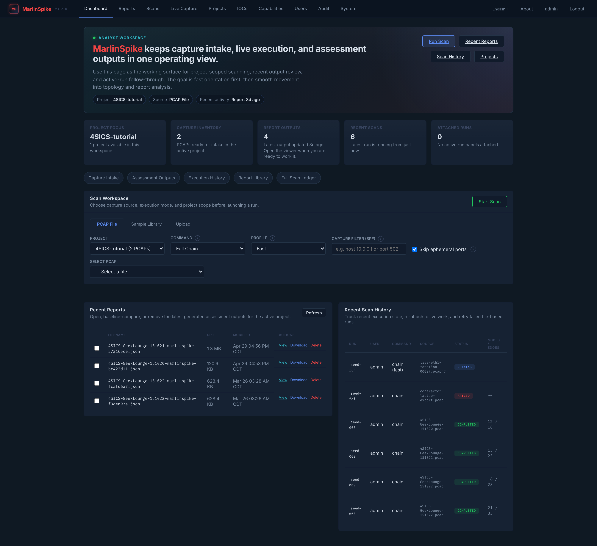
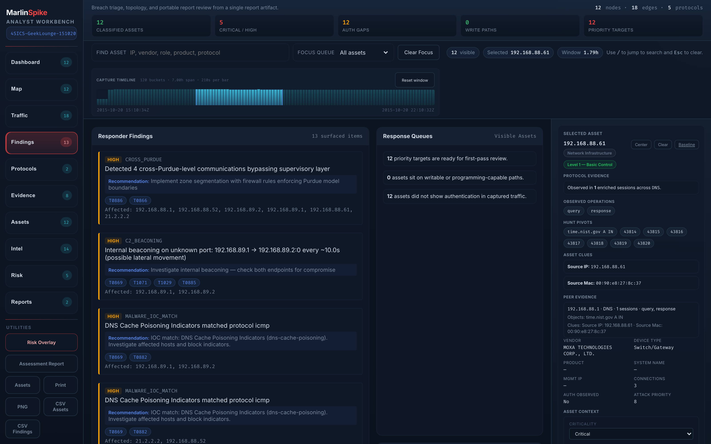
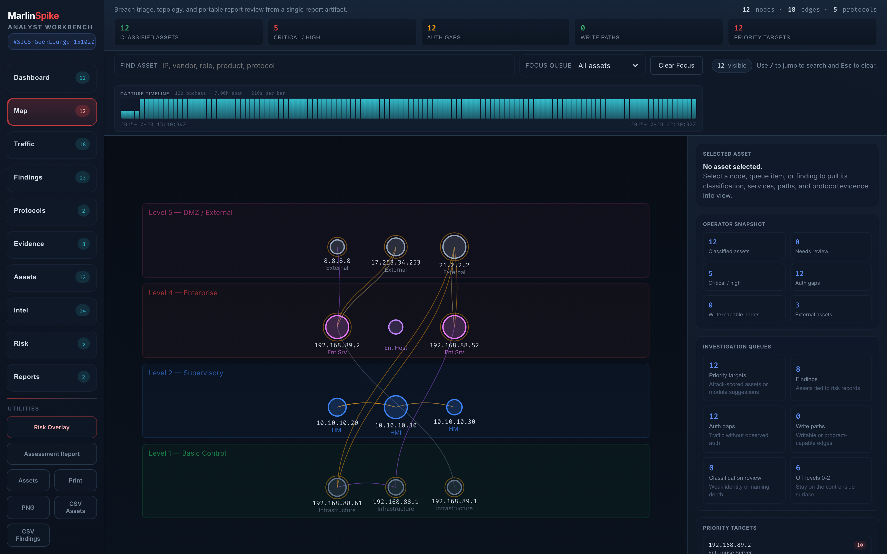

# Getting Started

A 30-minute, follow-along tutorial. By the end you'll have:

- MarlinSpike running locally.
- An admin account.
- A project containing one PCAP and one report.
- Walked the analyst loop on that report.
- Tagged an asset as `critical`.
- Written your first finding note.
- Run a quick IOC scan.
- Bookmarked an asset baseline.

This tutorial assumes you've used Wireshark or tshark before. It
does **not** assume any prior MarlinSpike knowledge.

If you're already running MarlinSpike and want reference material,
skip to [docs/README.md](README.md).

---

## Prerequisites

- Linux or macOS host with **Docker** and **Docker Compose**
  installed.
- A test PCAP. If you don't have one, the bundled preset library
  has 25 curated ICS captures from public sources — we'll use one
  in step 4.
- 10 minutes for setup, 20 minutes to walk the loop.

---

## 1. Bring up the stack

```bash
git clone https://github.com/eris-ot/marlinspike.git
cd marlinspike
cp .env.example .env
```

Open `.env` and set the three secrets:

```
DB_PASSWORD=<long random string>
SECRET_KEY=<another long random string>
ADMIN_PASSWORD=<the password you'll use to log in>
```

If you leave `ADMIN_PASSWORD` blank, the first boot generates one
and prints it to the container logs.

```bash
docker compose up -d --build
```

The first build takes a few minutes (it pulls
`marlinspike-dpi`, `marlinspike-mitre`, `marlinspike-malware`,
and the malware rules from pinned GitHub refs). Subsequent
boots are seconds.

Check it came up:

```bash
docker compose ps
docker compose logs -f app
```

The app log shows `Running on http://0.0.0.0:5001`. Open
**http://127.0.0.1:5001** in your browser.

---

## 2. Log in



Log in as `admin` / `<your ADMIN_PASSWORD>`. You land on the
Dashboard.

If `ADMIN_PASSWORD` was blank in `.env`, run
`docker compose logs app | grep "Username\|Password" -A1` to find
the generated one.

---

## 3. Create a project

Click **Projects** in the nav → **+ Create project**.

Name it `tutorial-2026` (or anything memorable — once you have a
real engagement you'll come back to the
[projects-and-engagements.md](projects-and-engagements.md) naming
guidance). Description optional.

You can also work in the auto-created `Default` project, but
having a named project means you can throw it away after the
tutorial without disturbing other work.


Open the new project — it has empty Overview / PCAPs / Reports /
History tabs.

---

## 4. Get a PCAP into the project

Three options:

### Option A: Use a preset

Click the **PCAPs** tab → **Add from preset library**. Pick any
ICS PCAP — `4SICS-GeekLounge-151020.pcap` is a good starter
(real ICS conference floor traffic, ~200MB, ~2.2M packets, lots
of OT protocols).

### Option B: Upload your own

Click the **PCAPs** tab → **Upload PCAP**. Pick a file from your
machine. Uploads are capped at the per-user
`upload_limit_mb` (default 200MB). For a starter pcap, anything
under 50MB analyzes in a few seconds.

### Option C: Drop one in via the filesystem

```bash
docker compose cp /path/to/local.pcap \
  marlinspike-app:/app/data/uploads/<user_id>/<project_id>/
```

The PCAP will appear in the PCAPs tab on next refresh.

After whichever option, you have a PCAP visible in the **PCAPs**
tab.

---

## 5. Run your first scan

In the PCAPs tab, find your PCAP row → **Scan** button. A modal
appears with two profile options:

- **Fast** — skips ephemeral edges, lowers collapse threshold,
  skips C2 heuristics. Use for live-capture rotations and quick
  sanity checks.
- **Full** — full pipeline including C2 detection. Default for
  first-pass triage.

Pick **Full** for the tutorial. Click **Start scan**.

You'll be taken to the scan-progress viewer. The pipeline is
roughly:

```
ingest → dissect → topology → risk → ATT&CK
```

For a 200MB capture with the Rust DPI engine enabled (default),
the whole chain finishes in under 60 seconds. For a 5MB
test PCAP, under 5 seconds.

When status reads `completed`, the **View report** button is
clickable. Click it.

---

## 6. The workbench

You're now in the workbench — `/api/reports/<filename>`. This is
where you'll spend most of your time on real engagements.



The first thing to do — **always** — is read the provenance chips
at the top of the content area. They tell you whether this is the
right capture: filename, link type, packet count, duration,
unique MACs, unique IPs.

If those numbers look wrong (e.g. 12 packets), stop and
re-collect. For the tutorial, they'll be fine.

### Walk the rail, top to bottom

The left rail has 10 modes. We're going to walk them in the
order the [analyst loop](triage-methodology.md) recommends.

#### Step 1 — Dashboard

Default mode. The **Operator Snapshot** strip shows the capture
KPIs. Look at the CRITICAL/HIGH count: these are the findings
we'll triage in step 8.

The **Investigation Queues** are quick filters — click any to
land on Findings pre-filtered.

The **Top Findings** table is the highest-severity findings with
clickable rows.

#### Step 2 — Map (inventory)



Click **Map**. The topology renders as a force-directed graph
with Purdue band layout — external nodes at top (Level 5),
process equipment at bottom (Level 0).

Click any node. The **Selected Asset** sidebar populates with
identity, role, vendor, peers, findings.

Try dragging nodes around. Try wheel-zooming. Right-click the
background to reset.

#### Step 3 — Traffic

Click **Traffic**. You're now in the Traffic Statistics pane.
Read the top conversations by bytes — usually one or two pollers
dominate.

Read the **protocol byte distribution** stacked bar. OT captures
often look protocol-X-heavy by packet count but TLS-heavy by
bytes. Take note.

#### Step 4 — Protocols

Click **Protocols**. The **Protocol Roster** chip strip at the
top is the headline view. Lit chips = protocols present in this
capture. Dim chips = protocols the engine looked for but didn't
find.

Each lit family has a function-code / object-group / type-ID
breakdown below. For Modbus on the 4SICS preset you'll see read
operations dominating with a small write-coil count — the
presence of any writes on a read-mostly network is worth a glance.

#### Step 5 — Time scrubber

Look below the toolbar — there's a histogram of packet rate over
the capture timeline.


For a flat capture, the histogram is roughly even. For one with
event activity, you'll see spikes. Try **dragging** a window
across a section. Notice that Traffic mode and Protocols mode
re-compute their tables to only show conversations from the
selected window.

Click outside the window to clear. We'll come back to this in
step 8.

#### Step 6 — Asset context

Go back to **Map**. Click on any asset that looks important —
preferably a high-degree node like an HMI or PLC.

In the **Selected Asset** sidebar, scroll to **Asset Context**.

Set:

- **Owner**: `Tutorial — sample`
- **Criticality**: `critical`
- **Zone**: `tutorial`
- **Business function**: `tutorial test`

Saves are inline (on blur for text fields, on change for the
dropdown).


Now scroll to the per-asset **Findings**. Notice that any
finding touching this asset has had its severity bumped one
tier — the small pill `→ CRITICAL (asset criticality)` shows
the bump. See [asset-context.md](asset-context.md) for the
full rule.

This is a big deal. **Site-specific severity matters**, and
MarlinSpike turns analyst knowledge into structured data.

---

## 7. Run a quick IOC scan

Click **IOCs** in the global nav. Select your `tutorial-2026`
project at the top.


Click **+ Create list**. Name it `tutorial-iocs`. Click create.

In the right panel, paste this into the bulk-import textarea:

```
# Test IOCs — pasted during the tutorial.
# These are intentional fake values to demonstrate the workflow.
192.168.1.1
8.8.8.8
google.com
example.com
00:11:22:33:44:55
```

Click **Import**. The response will say `Imported 5, skipped 0`.

Now click **Scan project reports**. The scanner walks every
report in the project (just one, our tutorial scan) and matches
the indicators against nodes / conversations / DNS queries / etc.

If any of these IOCs happen to match traffic in your capture,
you'll see hits. If not, you'll see "No hits across the
project's reports." — which is the right answer for randomly
fabricated indicators.

In a real engagement, you'd paste indicators from a vendor
advisory or threat-intel feed instead. See
[ioc-threat-hunting.md](ioc-threat-hunting.md).

---

## 8. Triage your first finding

Back to the workbench (browser back, or click **Reports** → your
report).

Click **Findings** in the left rail. Pick the highest-severity
finding (CRITICAL or HIGH).

Read it carefully:

- **Description** — what the engine concluded.
- **Affected nodes** — clickable; click one to select on Map.
- **Remediation** — IEC 62443-mapped guidance.
- **ATT&CK chips** — tactic / technique / sub-technique.

If the finding looks real, click **Add note…** (or **Edit
note…** if a note already exists). Status: `investigating`.
Body: `Walking through tutorial. Verified on 2026-05-07 — the
finding is real and concerns asset 10.x.x.x.`

Save. Reload the workbench. The note now renders inline next to
the finding, with a status pill.

> *[screenshot needed: Findings pane row with attached note showing status pill and body text inline]*

The note is keyed against the finding's stable signature. If you
re-scan the same PCAP (different report ID), the note re-attaches
to the equivalent finding automatically. See
[asset-context.md](asset-context.md).

---

## 9. Carve out a sub-PCAP

Find any conversation in the **Traffic** pane that looks
interesting. Click **Extract** on its row.

Browser downloads `<report-stem>-extract.pcap`. Open it in
Wireshark to verify the carved-out packets match the
conversation.

Try the same with a time-window active — drag a window in the
scrubber, then click **Extract** on a conversation. The PCAP
contains only packets in the window.

The endpoint caps at 500K packets and 60-second wall-clock; for
larger windows, narrow the conversation tuple or window. See
[time-scrubbing-and-extract.md](time-scrubbing-and-extract.md).

---

## 10. Bookmark the asset baseline

Back to the workbench. Click the asset you tagged as `critical`
in step 6. In the **Selected Asset** sidebar, click **Baseline**.

A new tab opens with the per-asset longitudinal page. Right now
it shows just one column (one report — your tutorial scan), so
the baseline isn't very informative.


This is the surface that gets *more useful with every capture*.
On a real engagement with 14+ captures of the same network, the
baseline shows:

- Identity timeline (drift detection on vendor / role / device
  type).
- Protocol-mix history (what this asset has been talking, per
  capture).
- Peer set with first-seen / last-seen attribution.
- Finding cadence (`persistent` / `new` / `lost` /
  `intermittent`).
- The **novelty-vs-baseline card** — the headline value: what's
  *new* in the latest capture compared to everything before.

For now, just bookmark the URL pattern:
`/projects/<pid>/assets/<asset_key>`. Once you have multiple
captures, return here. See [asset-baselines.md](asset-baselines.md).

---

## 11. End-of-engagement view: the Project Overview

Click **Projects** in the global nav → click your
`tutorial-2026` project. Land on the **Overview** tab.


With one report, the Overview is just the report's contents
slightly reformatted. With 5+ reports, it becomes the headline
view — every asset deduped across captures, every finding
deduped (with severity promoted to highest seen), every
protocol union'd, every ATT&CK technique surfaced.

This is the surface you'd screenshot for an executive readout
at the end of an engagement. See
[projects-and-engagements.md](projects-and-engagements.md).

---

## 12. Optional: try live capture

If you're on Linux and have a SPAN port or tap (or just want to
sniff on `lo`):

In `.env`:

```
LIVE_CAPTURE_ENABLED=true
```

```bash
docker compose --profile capture up -d --build
```

This brings up the privileged `marlinspike-capd` sidecar. Click
**Live Capture** in the nav.


Pick an interface, type a BPF (`tcp port 80` works for testing
on `lo`), click **Start capture**.

The active session panel shows live SSE-driven counters. Each
time the dumpcap rotation closes a file, a new MarlinSpike scan
runs against it and a new report appears in the project's
Reports tab.

For real engagements, see [live-capture.md](live-capture.md) for
the OT BPF cookbook (Modbus / S7 / DNP3 / IEC-104 / CIP / OPC-UA
/ BACnet / PROFINET / GOOSE / SV / FINS).

---

## You're done

You've walked the full analyst loop on a real capture. The
shape of the work transfers directly to engagements:

- One project per engagement / site / zone.
- Multiple captures per project — morning + evening, or live-
  capture rotations.
- Walk the loop on every new capture.
- Tag asset criticality early; site-specific severity matters.
- Write notes; future you and your colleagues will thank you.
- Run IOC scans when you have actor / advisory intel.
- Check the per-asset baseline for `critical`-tagged assets.
- Project Overview is the executive readout surface.

## Next reading

- **[triage-methodology.md](triage-methodology.md)** — the
  full analyst loop, with anti-patterns to avoid.
- **[workbench-guide.md](workbench-guide.md)** — every pane in
  detail; reference doc.
- **[projects-and-engagements.md](projects-and-engagements.md)**
  — multi-capture engagement workflow.
- **[live-capture.md](live-capture.md)** — when you have a SPAN
  port and want MarlinSpike to run the capture.
- **[../INSTALL.md](../INSTALL.md)** — production deployment,
  TLS, env vars.

The full docs index is at **[docs/README.md](README.md)**.

---

## Cleanup

When you're done with the tutorial:

```bash
docker compose down -v
```

`-v` removes the volumes, so the database and uploaded PCAPs
are gone. Drop it if you want to keep the tutorial state.
