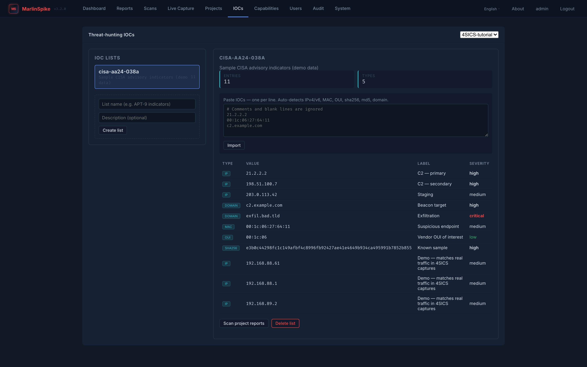
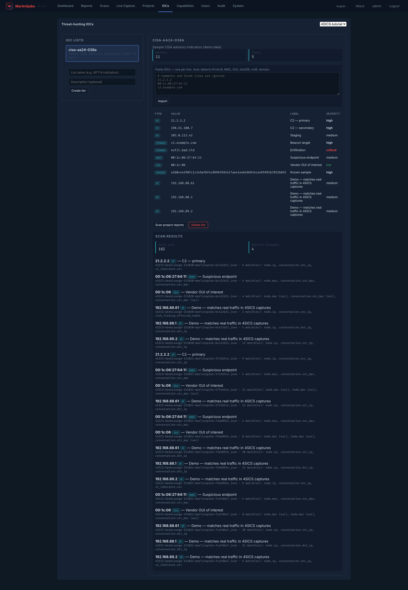

# IOC Threat-Hunting

The `/iocs` page is for **cross-report indicator-of-compromise
hunting** within a project. You build a list of indicators (IPs,
MACs, OUIs, domains, hashes), then scan every report in the project
in one pass. Hits surface as a table with severity, type, and
report-attribution.

This is distinct from the engine's built-in detection. The engine
already finds C2 beaconing, DNS exfiltration, ICS-protocol abuse,
malware-IOC matches (Stage 4b, when rules are loaded), and APT
lateral-movement patterns — those surface in the regular Findings
pane without explicit IOC lists.

The IOC page is for the case where *you have intel* — a known
threat actor's infrastructure, a hash from a recent advisory, a
suspicious domain a colleague flagged — and you want to check
whether your captured traffic touched it.

---

## When to use it

Use IOC hunting when:

- You're responding to a **specific advisory** (vendor PSIRT,
  CISA alert, ISAC bulletin) with named indicators.
- You're hunting a **specific threat actor** with known
  infrastructure (C2 IPs, staging domains, malware hashes).
- You're verifying **negative results** for a compliance or
  regulatory ask ("we have no evidence of contact with these
  domains in the last 30 days of captures").
- You're maintaining an **internal block-list** and want to catch
  any historical traces of recent additions.

Don't use it for general assessment — the engine's built-in
detection is much more comprehensive than any IOC list you'll
maintain by hand.

---



## Page layout

`/iocs` is a two-column layout:

```
┌────────────────────────────────────────────────────────────┐
│ Project picker (top)                                       │
├────────────────────┬───────────────────────────────────────┤
│ IOC Lists          │ Detail / Import / Scan                │
│ ─────────────      │ ────────────────────                  │
│ APT-9 indicators   │ List metadata (name, desc, source)    │
│ Modbus block-list  │ Entry table (type, value, label, sev) │
│ + Create new       │ Bulk-import textarea + Import button  │
│                    │ Scan button + result table            │
└────────────────────┴───────────────────────────────────────┘
```

- Left: per-project list of IOC lists. Click to select.
- Right: detail view of the selected list, plus the import and scan
  controls.

Lists are scoped to the project picked at the top — switching
projects swaps the left panel.

---

## IOC types

Six recognized types, auto-detected per line during bulk import:

| type | matches | example |
|---|---|---|
| `ip` | IPv4 and IPv6 addresses | `21.2.2.2`, `2001:db8::5` |
| `mac` | EUI-48 in any common format | `00:1c:06:27:64:11`, `001c.0627.6411` |
| `oui` | first 24 bits of a MAC | `00:1c:06`, `001c06` |
| `domain` | DNS name fallback when nothing else matches | `c2.example.com` |
| `sha256` | 64-hex SHA-256 | `e3b0c44298…852b855` |
| `md5` | 32-hex MD5 | `d41d8cd98f…ecf8427e` |

Type detection runs per-line via regex. If you paste a line that
looks like a hash but isn't 32 or 64 hex chars, it falls through
to `domain` and probably won't match anything — the import response
shows `skipped: 1 (invalid)` so you know to fix it.

You can also explicitly set type via the API
(`POST /api/projects/<pid>/iocs/<list_id>/entries`); the page-level
import is type-inferred for convenience.

---

## Creating a list

Right panel → **Create list**. Fields:

- **Name** (required) — keep it descriptive: `apt-mustang-panda`,
  `cisa-aa24-038a`, `internal-blocklist-2026q2`. The
  `(project_id, name)` pair is unique.
- **Description** (optional) — what this list is, when you got it,
  why it's still useful.
- **Source** (optional) — `manual` / `csv` / `misp` / `stix`. The
  v3.1.0 bulk-paste workflow stores `source=manual`. STIX 2.1 and
  MISP imports are roadmap.

Empty lists are fine. Add entries via the bulk-paste textarea.

---

## Bulk import

Right panel, with a list selected → **Import**. The textarea accepts:

```
# Comments and blank lines are ignored.

# IP indicators
21.2.2.2
198.51.100.7
2001:db8::5

# MACs / OUIs
00:1c:06:27:64:11      # full MAC
00:1c:06                # OUI prefix

# Domains
c2.example.com
exfil.bad.tld

# Hashes
e3b0c44298fc1c149afbf4c8996fb92427ae41e4649b934ca495991b7852b855
d41d8cd98f00b204e9800998ecf8427e
```

Lines starting with `#` are ignored. Blank lines are ignored.
Whitespace is trimmed. Trailing inline comments after the value
are NOT supported (the entire token after whitespace is the value).

Click **Import**. The response summarizes:

```
Imported 47, skipped 3 (dupes / invalid).
```

The skipped breakdown is dupes (already in the list, by
`(list_id, type, value)` unique constraint) plus invalid (regex
didn't match any type). If invalid, the response includes
`Errors:` with line numbers and the reason per line.

Severity and label are not bulk-importable in v3.1.0 — bulk-imported
entries get `severity=null, label=null`. Edit per-entry via the API
if you need them.

---

## Running the scan

With a list selected, hit **Scan project reports**. The scan walks
every report in the project (server-side) and matches list entries
against:

| match surface | indicator types matched |
|---|---|
| `nodes[].ip` / `nodes[].mac` | ip, mac, oui (oui matches any MAC sharing the 24-bit prefix) |
| `conversations[].src_ip` / `.dst_ip` / `.src_mac` / `.dst_mac` | ip, mac, oui |
| `c2_indicators[].dst_ip` / `.dst_domain` | ip, domain |
| `risk_findings[].evidence.*` | ip, mac, domain (when evidence carries those fields) |
| `dns_queries[].query` | domain |
| `malware_findings[].sha256` / `.md5` | sha256, md5 |

Hits return as a table:

| column | meaning |
|---|---|
| Type | the IOC type that matched |
| Value | the IOC value |
| Label | optional label set on the IOC entry |
| Severity | optional severity set on the IOC entry |
| Match Surface | `node` / `conversation` / `c2_indicator` / `risk_finding` / `dns_query` / `malware_finding` |
| Report | report filename where the hit occurred |
| Asset | resolved asset identity at the match location |

Rows are clickable: clicking opens the originating report in the
workbench and selects the relevant asset.



### Hit cap

The scan caps at **1000 hits** per scan. If hit count exceeds
that, the response includes `truncated: true` and the table shows
*"Showing first 1000 of {N} hits — narrow your IOC list or scan
fewer reports."*

This is to keep the page responsive on incidents with extremely
broad indicator sets. If you genuinely need >1000 hits enumerated,
hit the API directly:

```
POST /api/projects/<pid>/iocs/<list_id>/scan?limit=10000
```

---

## Negative-result hunting

A common compliance ask is *"prove you have no traces of these 47
indicators."* IOC hunting is the right tool:

1. Create a list named `cisa-aa24-038a` (or whatever the advisory
   ID is).
2. Bulk-paste all 47 indicators.
3. Scan.
4. Screenshot or CSV-export the empty result.

The empty result *is the answer*. Combine with the project's report
list (every capture you've collected, with timestamps) and you
have a defensible negative.

Re-run periodically as new captures roll in.

---

## STIX / MISP roadmap

The v3.1.0 release shipped the bulk-paste MVP because it gets you
to "useful in 30 seconds" without the bus factor of a STIX parser.
STIX 2.1 import and MISP feed sync are flagged for follow-up — see
the v3.1.0 entry in [releases.md](../releases.md).

Until those land, MISP and STIX users typically:

- Pull a flat list from the upstream (MISP `/events` filtered to
  Indicators-only, exported as CSV; STIX 2.1 bundle parsed via
  the `stix2` library to a flat list).
- Bulk-paste into MarlinSpike.

It's an extra step, but it works.

---

## Maintenance

IOC lists are mutable. Add entries, remove entries, rename the
list. The unique constraint on `(list_id, ioc_type, value)`
prevents duplicate entries, so re-importing a CSV that overlaps
with previous imports just adds the new ones.

When a list becomes stale (advisory aged out, threat actor
infrastructure rotated), delete it. The **Delete list** button on
the right panel cascades to all entries.

A reasonable rotation discipline: per-engagement IOC lists are
project-scoped and die with the project. Long-lived block-lists
live in a dedicated `blocklist` project and get re-scanned against
new captures as they land.

---

## What it doesn't do

- **No real-time alerting.** IOC hunting is on-demand against
  existing reports. For real-time alerting on new captures, you
  want a SOC stack (and FATHOM if you're going OT-specific).
- **No active blocking.** MarlinSpike is passive. Hits tell you
  *what happened*; remediation happens elsewhere.
- **No upstream feed sync.** Today, all entries are imported by
  hand. You can script it with the API, but there's no built-in
  poller.
- **No regex / wildcard indicators.** All matches are exact, except
  OUI which is a 24-bit prefix on a MAC. *.example.com matching
  is roadmap.
