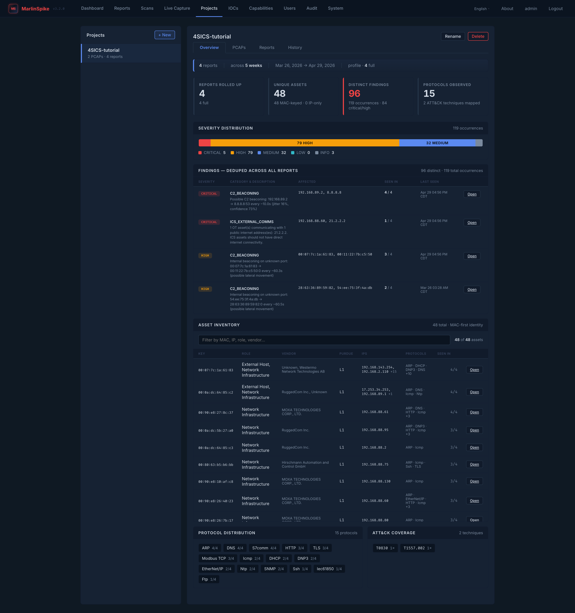
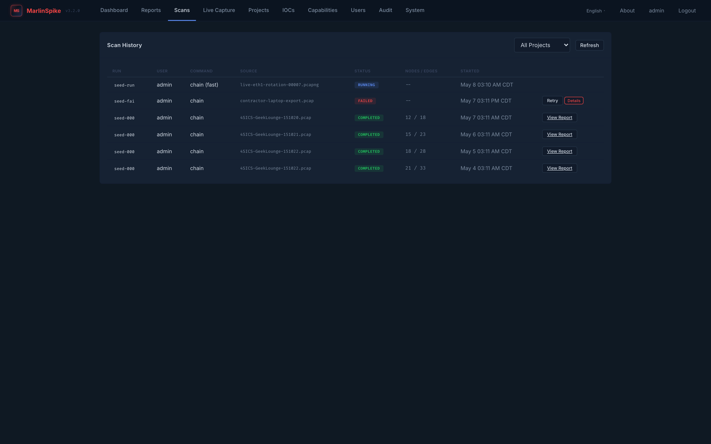

# Projects and Engagements

A **project** is the unit of work in MarlinSpike. One project per
engagement, per site, or per zone — pick the granularity that
matches how you'll think about the data six months from now.

This document covers:

- The project model — what's scoped to a project and what's global.
- The Project Overview tab — cross-report aggregation across every
  scan in the project.
- Multi-capture engagement workflow — how to use projects to manage
  long engagements with many captures.
- Per-user upload limits and access boundaries.

For workbench triage *inside* a project (one report at a time), see
[workbench-guide.md](workbench-guide.md). For the analyst loop, see
[triage-methodology.md](triage-methodology.md).

---

## What's scoped to a project

These resources belong to a single project:

| resource | created when | scope |
|---|---|---|
| **Reports** | every scan output (uploaded PCAP scan, live-capture rotation scan, CLI output you import) | per-project |
| **PCAPs** | every upload + every live-capture rotation file | per-project (live-capture files keyed by session UUID) |
| **Scan history** | every scan you start | per-project |
| **Asset tags** | when you populate the Asset Context section in any report's Selected Asset sidebar | per-project, MAC-first / IP-fallback keying |
| **Finding notes** | when you write a note on any finding | per-project, signature-keyed (so notes survive re-scans of the same capture) |
| **IOC lists** | when you create one in `/iocs` | per-project |
| **Saved capture filters** | when you save a BPF in the live-capture page | per-project |
| **Capture sessions** | every live capture you start | per-project (session attributed to the project picked at start) |

These are **global**:

| resource | scope |
|---|---|
| Users | global |
| Audit log | global |
| Capabilities catalog | global |
| MITRE ATT&CK rule packs | global |
| Plugin configuration (APT, ARP, malware IOC) | global |

The implication: switching projects gives you a *clean working
context* for assets / findings / IOCs, but admin and audit are
unchanged.

---

## Creating a project

`/projects` → **Create project**. The only required field is the
name; an optional description helps when you have many projects.

**Project naming convention.** A name shows up in many surfaces; pick
something durable:

- `acme-zone3-2026q2` — site, zone, quarter. Survives the engagement.
- `acme-incident-2026-05-07` — incident-flavored.
- `apt-hunt-may` — bad. Means nothing in November.

Per-user `(name)` uniqueness is enforced (the same user can't have
two `Default` projects). Different users can have same-named projects
without conflict.

**Default project.** If you upload a PCAP or run a scan without
picking a project, MarlinSpike auto-creates a per-user project named
`Default` and attributes the work there. This means new users get a
working context immediately; long-time users with messy `Default`
projects can re-attribute work via the API or rename.

---

## Project page layout

`/projects/<pid>` opens the project page with four tabs:

| tab | content |
|---|---|
| **Overview** | cross-report aggregation (the headline view, default landing tab) |
| **PCAPs** | uploaded captures, live-capture rotation files, preset library files |
| **Reports** | every report attributed to this project, with diff/compare and view/download/delete actions |
| **History** | every scan run (running, completed, failed, stopped) with retry and error-detail affordances |

Switch tabs with the tab bar at the top. Tabs are project-scoped — a
URL like `/projects/4` doesn't carry the active tab in the path.

---

## The Overview tab

The Overview tab is the project's most important surface. It walks
**every report in the project** and rolls them up into a single view.

### What gets aggregated

Implementation lives in `marlinspike/aggregate.py`. The aggregator:

- **Dedupes assets** across captures using MAC-first / IP-fallback
  keying. An asset that appears in 3 of 5 reports counts once, with
  attribution showing in which reports it was first and last seen.
- **Dedupes findings** using the stable signature
  `sha256-32(category, sorted(affected_nodes), sorted(affected_edges))`.
  An identical finding present in 4 captures counts once, with
  occurrence-count = 4.
- **Promotes severity** to the highest seen across captures. If the
  same finding shows as MEDIUM in capture 1 and CRITICAL in capture
  3 (because the engine learned more in the later capture), the
  rolled-up entry shows CRITICAL.
- **Latest-wins on description** — the most recent capture's
  description text wins, on the assumption it's the most refined.
- **Walks plugin findings** — APT and ARP plugin findings roll up
  alongside engine findings via the existing extension bridge.

Aggregation is **pure compute**. No DB writes, no schema migration.
Re-aggregation is fast even on projects with many reports.

### What renders

The Overview tab shows:

- **KPI strip** — reports rolled up, unique assets, distinct
  findings, protocols observed. A red accent stripe lights up when
  CRITICAL or HIGH > 0.
- **Severity distribution bar** — five-class legend with inline
  counts (`8 CRITICAL`, `4 HIGH`, `12 MEDIUM`, `7 LOW`, `15 INFO`).
- **Deduped findings table** — sorted by severity then occurrence
  count. Each row shows category, severity (with contextual-severity
  overlay applied), affected-asset count, occurrence count, and the
  reports where it appeared.
- **Asset inventory** — every unique asset across the project.
  Filter toolbar at the top with substring search by MAC / IP /
  role / vendor. Bounded scroll.
- **Protocol distribution** — every distinct protocol family the
  project's reports observed.
- **ATT&CK coverage chip set** — every distinct technique surfaced
  across the project.

The workspace hero is hidden on Overview to avoid duplicate framing —
the KPI strip *is* the framing.

### When to use it

- **Engagement summary day.** End-of-engagement, the Overview is
  the surface you screenshot for the executive readout.
- **Onboarding a new analyst** mid-engagement. Hand them the URL;
  they get the full project state in one screen.
- **Multi-capture triage.** When you run morning + evening captures
  for a week, the Overview is where you spot finding cadence
  (something CRITICAL in 12 of 14 captures is the priority; a
  one-off finding from one capture might be noise).

Overview data is computed on-demand. There's no nightly job, no
warm cache. Every Overview load re-walks the reports, which is fine:
on the 4SICS benchmark project (2 reports, 42 assets, 12 distinct
findings), Overview renders in well under a second.

---

## The PCAPs tab

Uploaded captures (per-project), preset-library captures (shared,
read-only), and live-capture rotation files. Each row shows:

- Filename
- Size
- SHA-256 (clickable to copy)
- Source (`upload`, `preset`, `live:<iface>:<rotation>`)
- Actions: **Scan** (re-scan with chain), **Download**, **Delete**

For uploaded captures, an **Upload** affordance at the top of the
list opens a file picker. Per-user `upload_limit_mb` is enforced
server-side (default 200 MB). The 5 GB engine-side cap remains the
hard upper bound.

For live-capture rotations, the originating CaptureSession's
session_uuid links back to the live-capture history.

---

## The Reports tab

Every report in the project. Each row:

- Report filename
- Source PCAP filename
- Generated-at timestamp
- Asset count
- Finding count (with severity breakdown)
- Actions: **View** (workbench), **Download** (raw JSON),
  **Compare** (baseline-vs-new diff), **Delete**

The **Compare** action is project-scoped: pick any two reports, get
a diff highlighting new findings, resolved findings, new assets,
peer-set deltas, protocol-mix shifts.

For comparing the *same asset* across many reports, prefer the
per-asset baseline page. See
[asset-baselines.md](asset-baselines.md).

---

## The History tab

Scan runs, including the ones that failed. Columns:

- Started-at
- Profile (`fast` / `full`)
- Command (`chain`, `chain-from-conversations`)
- Source (PCAP filename, `live:<session>` for live captures)
- Status (`running` / `completed` / `failed` / `stopped`)
- Duration
- Actions: **Retry** (re-run with same args), **View error** (last
  ~10 lines of engine output for failed runs), **Stop** (running
  scans only)

Retry is the right move when a scan fails and you've fixed the cause
(e.g. the upload was incomplete). It preserves the original profile
and command.

---

## Multi-capture engagement workflow

A typical assessment-engagement workflow:

1. **Day 0** — site survey, define zones, create projects:
   `acme-zone1-2026q2`, `acme-zone2-2026q2`, etc. One project per
   zone keeps the asset context (criticality tags, finding notes)
   bounded to one operating context.
2. **Day 1+** — start morning + evening captures per zone. Either
   upload PCAPs from your tap setup or kick off live captures from
   the engagement laptop's SPAN port.
3. **Each new report** — walk the analyst loop in
   [triage-methodology.md](triage-methodology.md). Tag asset
   criticality the first time you see each new asset. Write notes on
   findings the first time you triage them.
4. **End of day** — open the project's Overview tab. Cadence emerges
   here that no single report shows: which findings are persistent,
   which assets are intermittently absent, which protocols stopped
   appearing.
5. **Mid-engagement** — for each `critical`-tagged asset, pull up its
   per-asset baseline page. The novelty-vs-baseline card flags
   assets behaving differently than they have been. See
   [asset-baselines.md](asset-baselines.md).
6. **End of engagement** — Overview becomes the executive summary.
   CSV exports (Utilities) and the Assessment Report drawer become
   the auditor handoff.

Long incident-response engagements (weeks) compound the value.
Short single-day assessments still get value from Overview *the
moment a second report lands* — even two captures on the same
network produce useful cross-report attribution.

---

## Per-user upload limits

Each user has an `upload_limit_mb` field, default 200 MB. Set it
admin-side at `/users` → user row → upload-limit edit. The web
upload handler enforces it; the CLI engine ignores it (CLI users
have already passed the access boundary).

The 5 GB engine-side `PCAP_MAX_SIZE` and `PCAP_PROCESS_SIZE` (raised
in v2.0.4) remain the upper bound. If `upload_limit_mb=2048`, that
user can upload up to 2 GB; trying to upload more returns HTTP 413
with a clear message naming the configured limit.

For very large captures, the upload UI shows a progress bar and the
`projects.html` client-side check fetches the user's limit
dynamically from `/api/profile` so the rejection happens before the
upload starts.

---

## Access boundaries

Reports / PCAPs / scan history / asset tags / finding notes / IOC
lists / capture sessions are scoped to **the project's owning
user**. There is no project-sharing model. If you need a colleague
to triage a capture, the current options are:

- Share the report JSON (`Download` from the Reports tab) — they
  drop it into their own project's `Reports/` directory.
- Share the project bundle (msbundle format, when implemented — see
  [msbundle-format.md](msbundle-format.md)).
- Hand them admin credentials so they can read everyone's data
  (admins can list-all via the `?all=1` parameter on capture
  sessions, and have stop-override authority).

A real project-sharing / multi-tenancy model is on the roadmap but
not in 3.x. Today, "engagement team workspace" means *everyone is on
the same MarlinSpike instance with their own user, and they coordinate
out-of-band on which user owns which project*.

---

## Deleting projects

`/projects` → row → **Delete**. Cascades to:

- Reports (project_id NULL after cascade — see
  `marlinspike/models.py`; older models had `ON DELETE SET NULL`)
- Scan history rows
- Asset tags
- Finding notes
- IOC lists + entries
- Saved filters
- Capture sessions

PCAP files on disk are NOT cascaded — they survive project deletion
in `<DATA_DIR>/uploads/<user_id>/<project_id>/`. This is intentional:
deletes are reversible by re-creating the project and re-attributing
the files. Manually `rm` if you want them gone.

The `Default` project cannot be deleted. Rename it if you want.
