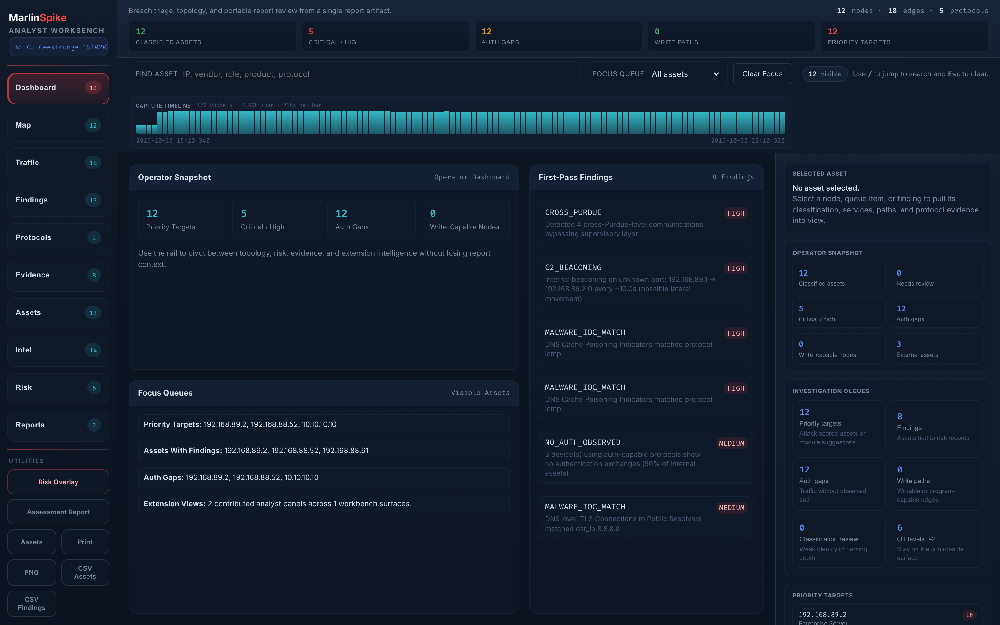

# Triage Methodology

This is the analyst loop MarlinSpike is shaped around. It's a
prescriptive walkthrough — *do these steps, in this order, on every
new capture* — and it tells you which workbench surfaces you should
land on at each step.

If you've spent time with NetworkMiner, Arkime, Wireshark, Corelight,
or Dragos, this loop will feel familiar. The OT-specific shape comes
from where MarlinSpike puts the per-asset baseline, the asset-context
overlay, and the IOC scan in the loop.

For per-pane reference, see [workbench-guide.md](workbench-guide.md).
This document is *how to think*, not *what each button does*.

---



## The loop, in eight steps

```
                ┌──────────────────────────────────────┐
                │   1. Provenance — is this the right  │
                │      capture?                        │
                └──────────────────┬───────────────────┘
                                   ▼
                ┌──────────────────────────────────────┐
                │   2. Inventory — who is on the wire? │
                └──────────────────┬───────────────────┘
                                   ▼
                ┌──────────────────────────────────────┐
                │   3. Traffic stats — what shape is   │
                │      the noise?                      │
                └──────────────────┬───────────────────┘
                                   ▼
                ┌──────────────────────────────────────┐
                │   4. Protocol drilldown — what are   │
                │      they actually saying?           │
                └──────────────────┬───────────────────┘
                                   ▼
                ┌──────────────────────────────────────┐
                │   5. Time-window scrubbing — when    │
                │      did the interesting thing happen?│
                └──────────────────┬───────────────────┘
                                   ▼
                ┌──────────────────────────────────────┐
                │   6. Asset context — which of these  │
                │      assets actually matter to the   │
                │      site?                           │
                └──────────────────┬───────────────────┘
                                   ▼
                ┌──────────────────────────────────────┐
                │   7. IOC overlay — does any of this  │
                │      match known-bad?                │
                └──────────────────┬───────────────────┘
                                   ▼
                ┌──────────────────────────────────────┐
                │   8. Findings + notes — what do I    │
                │      tell the operator, and what     │
                │      do I want to track?             │
                └──────────────────┬───────────────────┘
                                   ▼
              [carve out PCAPs / cross-report compare /
               baseline check / project-overview rollup]
```

The first four steps are *capture characterization*. The last four
are *triage*. Doing them in order matters — finding-led triage on a
mis-collected capture wastes hours.

---

## 1. Provenance — is this the right capture?

**Where:** the chip strip above the workbench content. See
[Provenance chips](workbench-guide.md#provenance-chips).

Open the report and read the chips before doing anything else:

- **Source** — does the filename make sense? Is it from the right
  site, the right SPAN port, the right shift?
- **Duration** — does it cover the timeframe you actually care about?
- **Packets / unique MACs / unique IPs** — sanity. A capture that
  claims to cover an OT subnet but shows two MACs and four IPs was
  collected from the wrong port.
- **Link type** — `EN10MB` is normal Ethernet. `LINUX_SLL2` means the
  capture was collected on the `any` pseudo-device, which loses
  some L2 detail. `RAW IP` means no L2 at all.

If any of this is wrong, **stop**. No amount of triage rescues a
mis-collected capture. Re-collect.

---

## 2. Inventory — who is on the wire?

**Where:** Map mode + Assets pane.

Two questions:

1. *Are the assets you expected to see, here?*
2. *Are there assets you didn't expect?*

Walk the topology with Purdue layering visible:

- **Level 0–2 (process / control / supervisory)** should match the
  site's known PLC / RTU / HMI inventory. Anything new is a finding.
  Anything missing means either the SPAN didn't see it or the
  device wasn't talking during the capture window.
- **Level 4–5 (enterprise / external)** should be tightly bounded.
  An OT subnet talking to public internet endpoints is a finding by
  default — verify and, if it's legitimate (NTP, vendor-specific
  call-home), tag the asset accordingly so future captures don't
  re-flag it.
- **Level 3 (operations)** is where the lines blur. Historians,
  engineering workstations, jump hosts. Tag these explicitly.

Flip to **Assets** for filterable inventory: substring search by IP /
MAC / vendor / role. Pull a CSV (Utilities → CSV Assets) for the
auditor handoff.

---

## 3. Traffic stats — what shape is the noise?

**Where:** Traffic mode.

Before you look at findings, look at *flow*. The workbench's Traffic
Statistics pane gives you:

- **Top conversations by bytes** — usually one or two SCADA pollers
  and a handful of management hosts dominate. If a different
  endpoint sits in the top-3, ask why.
- **Protocol byte distribution** — OT engagements often *look*
  Modbus-heavy by packet count but turn out to be TLS-heavy by
  bytes (firmware updates, vendor portals, Splunk forwarders).
  Mismatched byte vs. packet distribution is a useful prompt.
- **Top sources / destinations** — endpoints that sit in the top
  list on **both** axes are usually polling pairs. Endpoints that
  only appear as destinations are the more interesting nodes to
  investigate first.
- **Conversation-anomaly chips** — beaconing, high-entropy DNS,
  unsecured OPC. Each one is a click-to-pivot into Findings.

Don't deep-dive findings yet. The point of this step is to know the
shape of the network so the findings you read next are
contextualized.

---

## 4. Protocol drilldown — what are they actually saying?

**Where:** Protocols mode.

The Protocol Drilldown pane has a **Protocol Roster** chip at the
top. Lit chips are present families; dim chips are silent families.
Both matter:

- **Lit chips you didn't expect** — *"why is there CIP traffic on a
  Modbus subnet?"* — drill in.
- **Dim chips you did expect** — *"this is supposed to be a DNP3
  network and DNP3 is silent"* — that's a finding too. Either the
  SPAN missed it or the field assets aren't actually polling.

For each lit family, the workbench shows:

- **Function-code / object / type-ID breakdown** — what each
  protocol is *doing*. Reads vs writes vs control commands. The
  presence of write codes on a network where writes shouldn't
  happen is a CRITICAL finding.
- **Top-10 src→dst pair table** — who's having those conversations.

This is the surface where you build a mental model of the OT
operations on this network. Take notes; you'll need them later.

---

## 5. Time-window scrubbing — when did the interesting thing happen?

**Where:** the histogram below the toolbar.

Most OT captures are **flat**. Modbus polling at 1Hz looks identical
for hours. The interesting things are spikes, dips, or shape
changes:

- A sudden spike in S7 traffic at 02:13 — what changed?
- A dip in Modbus polling for 90 seconds in the middle of an
  otherwise-flat capture — did a poller fail, or did someone pull
  a cable?
- A new protocol family appearing 80% into the capture — onboarding
  or compromise.

Drag a window across the spike. Every conversation-driven pane
filters live to that window. Now Traffic mode shows what was
talking *during* the spike, Protocols shows what they were *saying*,
Findings shows which findings *root* in conversations from that
window.

When you've nailed down a sub-window of interest, hit **Extract** on
the Traffic table or Protocol Drilldown pair table. You get a
sub-PCAP scoped to the window, which you can open in Wireshark for
packet-level inspection. See
[time-scrubbing-and-extract.md](time-scrubbing-and-extract.md).

This step is the one most analysts skip on first pass. Don't.

---

## 6. Asset context — which of these assets actually matter?

**Where:** Selected Asset sidebar → Asset Context section.

Severity from the engine is generic. *Site-specific* severity comes
from you knowing which assets are critical at this site:

- A `CLEARTEXT_REMOTE_ACCESS` finding on a contractor laptop is
  *medium* — already-bad-practice but not critical to operations.
- The same finding on the safety system is **CRITICAL**.

MarlinSpike turns this knowledge into structured data. In the
Selected Asset sidebar, fill in:

- **Owner** — who do we call?
- **Criticality** — `low` / `medium` / `high` / `critical`.
- **Zone** — which network zone or process unit?
- **Business function** — turbine control, safety, tank gauging.
- **Free text** — anything else.

Tags persist project-wide and key on MAC first / IP fallback. The
moment you tag an asset `critical`, every finding touching it gets
its severity bumped one tier (capped at CRITICAL). Tag a host `low`
and findings only-touching low-tagged hosts drop one tier (floored
at INFO).

Do this **before** you start writing finding notes — the contextual
severity is what should be driving your prioritization.

See [asset-context.md](asset-context.md).

---

## 7. IOC overlay — does any of this match known-bad?

**Where:** `/iocs` page.

If this is an incident-response engagement (or even a
known-good-but-paranoid assessment), run the IOC scan now:

1. Pick or create the IOC list relevant to the threat actor / family
   you're hunting.
2. Bulk-paste indicators (IPv4/v6, MAC, OUI, sha256, md5, domain —
   types are auto-detected per line).
3. Click **Scan project reports**. The scan walks every report in
   the project, matches across nodes, conversations, c2_indicators,
   risk_findings, dns_queries, and malware_findings.
4. Hits return as a table. Click into the report each hit comes
   from.

If you have no specific IOC set, MarlinSpike's default detection
already covers C2 beaconing, DNS exfiltration, malware-IOC-match
(Stage 4b, when the rules are loaded), and APT lateral-movement
patterns — those surface in the regular Findings pane without an
explicit IOC list.

See [ioc-threat-hunting.md](ioc-threat-hunting.md).

---

## 8. Findings + notes — what do I tell the operator?

**Where:** Findings mode + Selected Asset → finding-attached notes.


Now triage. With provenance verified, inventory understood, traffic
shape known, time-window narrowed, asset context applied, and IOC
overlay run, the Findings pane is finally meaningful.

Walk findings top-to-bottom (they're already sorted by severity then
occurrence count, with contextual severity overlaid):

1. Read the description. The engine-emitted text plus your asset
   context tells you whether this is a real-and-actionable thing.
2. Read the remediation. MarlinSpike maps remediations to IEC 62443
   SR families when applicable.
3. Pivot to ATT&CK if the finding has a chip — does this fit a
   broader pattern with other findings?
4. **Write a note.** Status the finding (`open` / `investigating` /
   `resolved` / `false_positive`). Body the analysis. The note
   sticks to the finding's stable signature
   (`sha256-32(category, sorted nodes, sorted edges)`), so re-running
   the same capture or running a similar capture surfaces the same
   note inline next to the same finding next time.

Notes are how you track *your work* across an engagement. They're
also how a colleague picking up the engagement after you sees what
you already determined.

---

## After the loop

The loop above gets you through one capture. An engagement is many.

- **Cross-capture rollup** — open the project, hit the **Overview**
  tab. Every asset, every finding, every protocol, every ATT&CK
  technique deduped across every report in the project. Severity
  promotes to the highest seen. Asset attribution carries
  first-seen / last-seen across captures. See
  [projects-and-engagements.md](projects-and-engagements.md).
- **Per-asset longitudinal review** — for any asset you flagged as
  `critical`, click its Baseline button. The baseline page walks
  every report in the project and surfaces a single longitudinal
  profile: protocol-mix history, peer first-seen / last-seen,
  finding cadence ("seen in 14 of 28 reports"), drift detection on
  vendor / role / device-type, and a novelty-vs-baseline card that
  lists what's new in the latest report compared to everything
  before. See [asset-baselines.md](asset-baselines.md).
- **Live capture follow-up** — if the engagement is ongoing and you
  have SPAN / tap access, kick off a live capture filtered to the
  asset of interest. See [live-capture.md](live-capture.md).

---

## When to flip into HP-HMI mode

The default workbench renders Purdue level coloring across every
asset. That's informative when you're learning the network shape —
seeing the Level 5 / Level 4 / Level 2 / Level 1 stratification at a
glance is the point of step 2 (Inventory).

But once you're past the orientation phase and into actual triage,
all that color is noise. The question is no longer *"what's here?"*
but *"what needs attention?"* — and ISA-101's HP-HMI discipline
answers that better than rainbow-coded equipment does.

Flip HP-HMI on (button in the lens-strip control bar, next to Risk
Overlay / Assessment Report) when:

- **You're doing multi-asset triage on a dense network.** 50+ nodes,
  many of them benign. HP-HMI desaturates the benign so the eye
  finds the alarm-state assets in <1 second.
- **The screen is going on a NOC display or wall-mount.** Defenders
  glancing between tasks need the HP-HMI discipline — color reserved
  for actionable abnormality only.
- **You're working alongside ICS engineering teams.** They're trained
  on ISA-101. Flipping HP-HMI on is a credibility statement.
- **Step 7 onward (IOC overlay, finding prioritization).** By this
  point in the loop you know what's there. The signal you want is
  *which of these is bad*. HP-HMI is the right rendering for that.

Flip it back off when:

- **You're in step 1 or 2 (provenance, inventory).** Purdue coloring
  is signal at this stage, not noise.
- **You're capturing screenshots for a deliverable.** Default mode
  is more legible in printed PDFs and slide decks.
- **You're training someone on the platform.** Colored topology is
  more readable for someone learning what they're looking at.

The toggle is per-browser and persists across sessions. See
[workbench-guide.md#hp-hmi-mode](workbench-guide.md#hp-hmi-mode)
for the full discipline reference.

---

## Common anti-patterns

These are the failure modes we keep watching analysts run into.
Skip them.

- **Diving into Findings on first load.** The pane is sorted, has
  ATT&CK chips, looks complete. It's a trap on a mis-collected
  capture or one you don't yet understand the shape of. Always
  walk steps 1–4 first.
- **Tagging asset criticality after writing notes.** Asset context
  changes finding severity. If you tag after you've prioritized,
  your prioritization is now wrong — re-walk the Findings pane.
- **Skipping the time scrubber.** OT captures are flat for hours.
  The interesting moments are sub-second. The histogram is the only
  way to find them without looking at packet-level dumps.
- **Treating the workbench like a one-pass tool.** Reload, filter,
  pivot, narrow. The work happens in the iteration, not the first
  page-load.
- **Running IOC scans without saved lists.** Bulk-pasting the same
  300 indicators four times across an engagement is a waste; save
  them as a project IOC list once and re-scan as new captures land.

---

## What MarlinSpike *isn't* trying to be

This loop is for **assessment and incident-response triage**. It
isn't:

- A continuous-monitoring SIEM (use FATHOM or your existing SOC
  stack).
- An active scanner (MarlinSpike is passive; for active OT
  reconnaissance you want different tooling and a *much* tighter
  authorization scope).
- A general IT network tool (the engine knows OT protocols deeply;
  it knows IT enough to triage but not exhaustively).

When the question is *"is there anything wrong with this capture?"*,
the loop above is the answer. When the question is something else,
pick a different tool.
