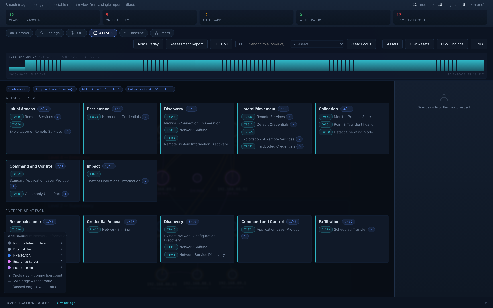
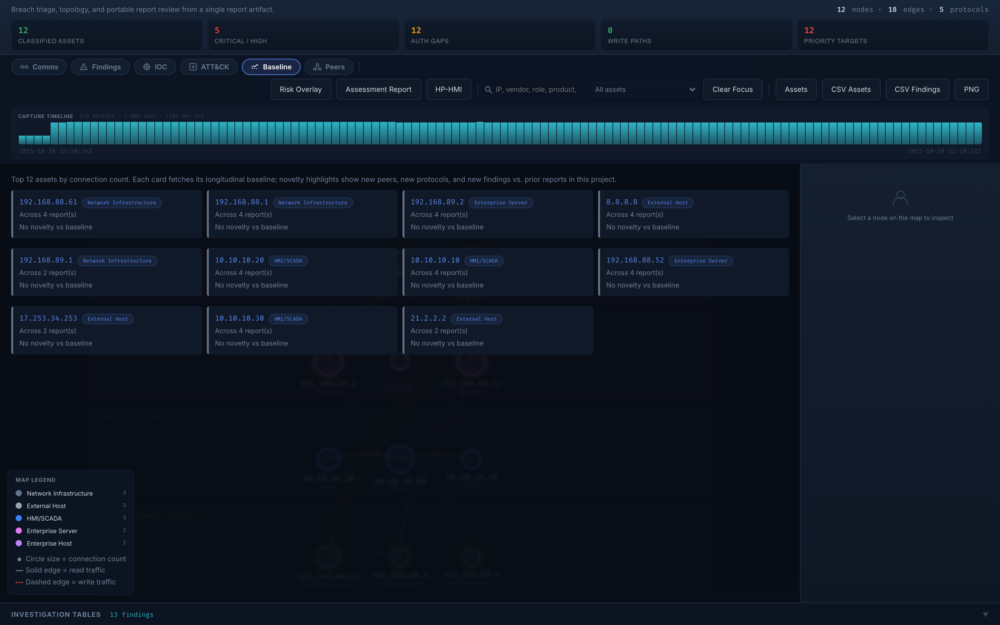
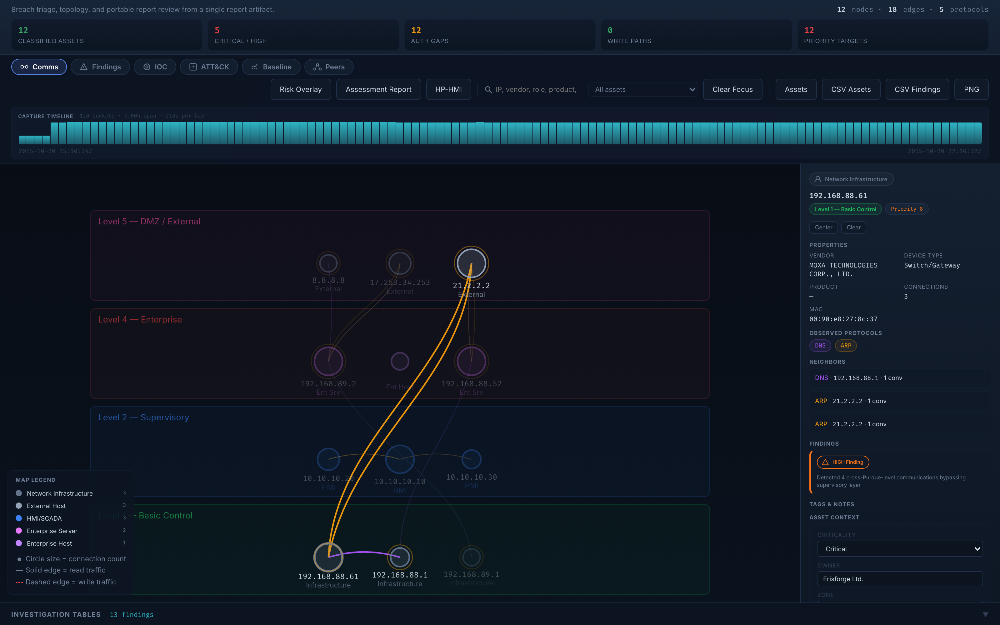
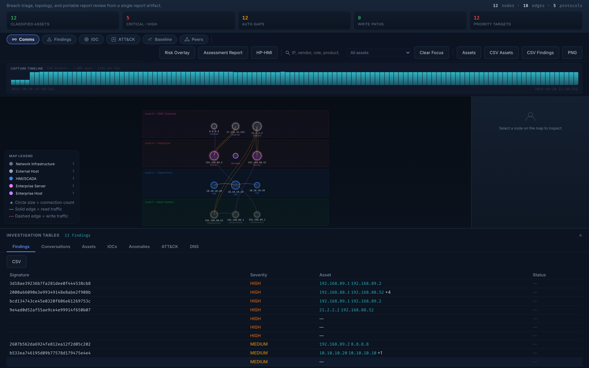
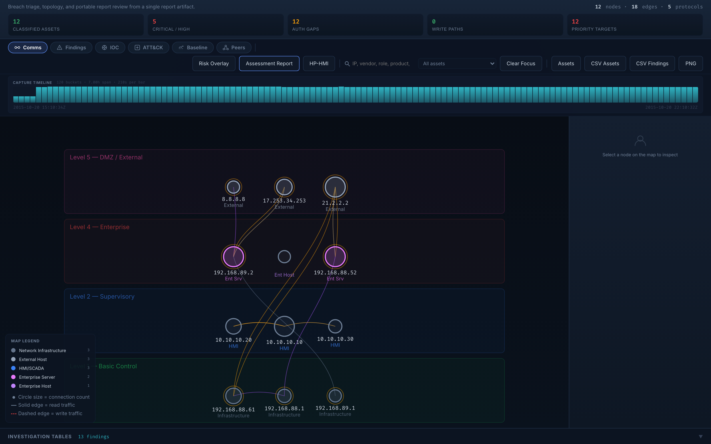
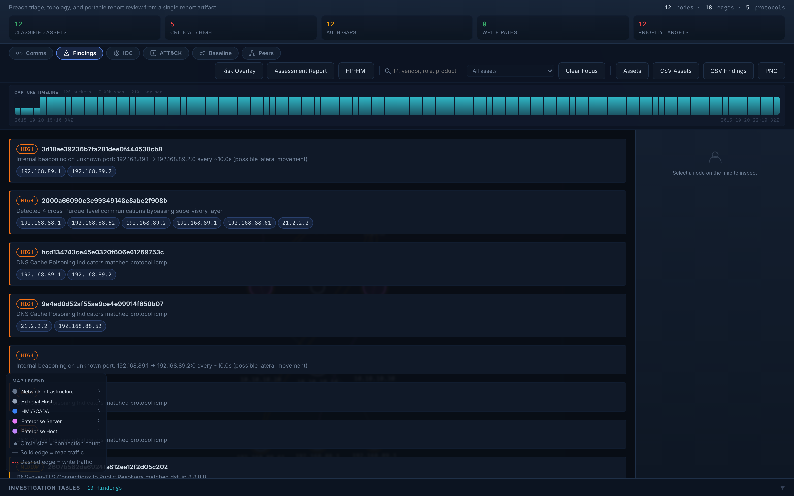
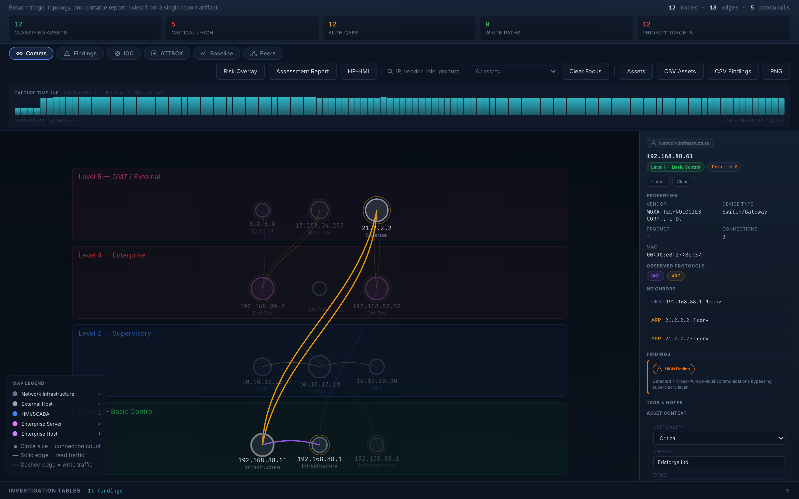

# Workbench Guide

The workbench is what you spend an engagement inside. It's the screen
that opens when you click any report — `/api/reports/<filename>/viewer`
— and it's where MarlinSpike turns a PCAP into something an analyst
can actually triage.

> **v3.5 — major reshape.** The workbench was rebuilt around a
> persistent **map canvas** with a **lens chip strip** at the top,
> a **dockable inspector** on the right, and a **slide-up drawer**
> at the bottom for tables. The old left-rail mode model is gone.
> If you're coming from v3.4 or earlier, the [Layout](#layout) section
> below is the new shape; map your old mental model onto it once and
> the rest of the guide makes sense.

For the analyst loop that *uses* these surfaces, see
[triage-methodology.md](triage-methodology.md). For project-level
aggregation across many reports, see
[projects-and-engagements.md](projects-and-engagements.md).

---


## Layout

```
┌──────────────────────────────────────────────────────────────────────────────┐
│  TOP BAR                                                                      │
│  [report meta] [time scrubber timeline]                              [mode ▼] │
├──────────────────────────────────────────────────────────────────────────────┤
│  LENS STRIP                                                                   │
│  [Comms] [Findings] [IOC] [ATT&CK] [Baseline] [Peers]    Risk · Report · HP-HMI│
├────────────────────────────────────────────────────────┬───────────────────────┤
│                                                        │                       │
│                                                        │   INSPECTOR           │
│                                                        │   (collapsible)       │
│                                                        │                       │
│              MAP CANVAS                                │   • selected entity   │
│              (the primary surface)                     │   • taxonomy chips    │
│                                                        │   • neighbor list     │
│                                                        │   • findings affecting│
│                                                        │   • tags / notes      │
│                                                        │   • pivot strip       │
│                                                        │                       │
├────────────────────────────────────────────────────────┴───────────────────────┤
│  ▲ INVESTIGATION TABLES — N findings    (drag handle to expand)               │
└──────────────────────────────────────────────────────────────────────────────┘
                                ▲
              click the handle, the drawer slides up:
┌──────────────────────────────────────────────────────────────────────────────┐
│  [Findings] [Conversations] [Assets] [IOCs] [Anomalies] [ATT&CK] [DNS]        │
│                                                                               │
│  ┌─ active table ──────────────────────────────────────────────────────────┐ │
│  │ click any row → highlights the corresponding nodes/edges on the map     │ │
│  └─────────────────────────────────────────────────────────────────────────┘ │
└──────────────────────────────────────────────────────────────────────────────┘
```

The map is the truth. Everything else is a lens or projection onto
it. The lens chip strip switches what edge type the map renders;
the inspector shows context for whatever entity you've selected; the
drawer is where you grep for the table view of the same data when
that's what you need.

---

## Lens chip strip

The lens strip sits across the top of the canvas zone and switches
what relationship the map is rendering. Same data, different edge
lens. Click any chip to flip; the active lens has a colored treatment
and everything else is muted.

| Chip | What the map shows | Source data |
|---|---|---|
| **Comms** (default) | Asset–asset conversations, edge weight by bytes, color by the most-severe finding involving the edge | `report.nodes` + `report.edges` |
| **Findings** | Severity-sorted finding cards in the overlay; clicking the affected-asset chips highlights nodes on the map | `report.risk_findings` |
| **IOC** | Halo on assets that match any IOC in the active list; per-match cards in the overlay | `viewer_context.ioc_matches` |
| **ATT&CK** | Tactic-grouped technique grid for ICS + Enterprise ATT&CK; click a technique to highlight affected assets. Live data from the `marlinspike-mitre` plugin output. | `viewer_context.mitre_classifications` + `mitre_matrix_domains` |
| **Baseline** | Per-asset cards (top 12 by connection count) showing novelty vs. project baseline — `+N peers`, `+N protocols`, `+N findings`, `−N lost peers`. Each card fetches `/api/projects/<pid>/assets/<key>/baseline` async. Severity-colored border tracks novelty intensity. | Per-asset baseline endpoint |
| **Peers** | Group chips by Role / Vendor / Purdue Level. Anomalous-by-context section flags assets whose role is unique at their Purdue level. | `report.nodes` |





---

## Inspector

When you click a node on the map (or a row in the bottom drawer), the
inspector populates with everything known about that entity:

- **Entity-type chip** — colored / iconified per the
  [taxonomy](taxonomy.md). Asset / Finding / IOC / Anomaly / Technique
  all get distinct visual treatment.
- **Identity** — MAC + IP for assets, signature for findings, src/dst
  pair for conversations, technique ID for ATT&CK entities.
- **Properties grid** — taxonomy-driven fields. Asset shows vendor /
  role / Purdue level / device type. Finding shows category / severity
  / contextual severity / mapped techniques.
- **Observed protocols** — chip strip with byte counts.
- **Neighbors / peers** — 1-hop list with click-to-pivot.
- **Findings affecting this entity** — inline finding cards.
- **Tags / notes** — editable. Asset criticality / zone / business
  function set here flows into the contextual-severity overlay.
- **Pivot strip** — "Show on Findings lens", "Show on IOC lens" —
  switches the active lens with this entity as focus.



The inspector collapses with the chevron in its top corner. Collapse
when you want maximum map area; expand for triage.

---

## Bottom drawer

Collapsed by default to a thin handle showing the active table name
and count. Click the handle to slide it up to ~40% viewport. Tabs
across the top of the drawer:

| Tab | What's there |
|---|---|
| Findings | Severity-sorted, click row to pivot to affected assets on map |
| Conversations | Top by bytes; src→dst with protocol; click row → highlight edge |
| Assets | Full asset roster; vendor / role / Purdue / connection count |
| IOCs | IOC match list (active project's IOC lists scanned against the report) |
| Anomalies | L2 / ARP anomalies from the engine's bilgepump consumer |
| ATT&CK | Flat technique list with affected-asset pivot |
| DNS | DNS observations table; query / type / answer / asset |

The drawer is where you go when you want to grep tables. The map is
where you go to think spatially. They share the same selection state
— click an asset row in the drawer and the map highlights it.



---

## HP-HMI Mode

> **High-Performance HMI** is a documented design discipline from
> ISA-101 / ASM Consortium / Hollifield 2008. Color is reserved for
> abnormal-condition signals only. Equipment, normal traffic, and
> identity chrome all desaturate to gray. The eye is drawn directly
> to **deviation**.

Click the **HP-HMI** button in the lens-strip control bar (next to
"Risk Overlay" and "Assessment Report") to toggle. Persisted in
`localStorage` — survives across sessions on the same browser. The
button is also available globally from the nav strip on every page.

### What changes

- **Topology**: assets without findings desaturate to gray.
  CRITICAL / HIGH-finding assets retain their alarm color. Normal
  traffic edges thin out; abnormal flows stay visible.
- **Lens strip**: only the active lens is colored. The rest are gray
  until clicked. Reduces interface noise.
- **Severity tiers**: CRITICAL and HIGH stay loud (those are
  alarm-actionable). MEDIUM / LOW / INFO chips desaturate to gray —
  they're informational, not actionable.
- **Identity chrome**: brand accents, cyan technique IDs, blue
  interactive buttons all read as muted neutrals. Color budget
  reserved for signal.
- **Selected asset retains color** even in HP-HMI mode — so the
  inspector context matches the alarm color you saw on the map.

### Side-by-side

| Default | HP-HMI |
|---|---|
|  |  |
|  |  |
|  |  |
|  |  |

### When to use

- **Always-on for control-room wall-mount.** If MarlinSpike is going
  on a NOC display where defenders glance at it between other tasks,
  HP-HMI is correct. The eye finds the alarm assets in <1 second.
- **Multi-asset triage on dense networks.** When you're staring at a
  500-node topology trying to find what's bad, HP-HMI removes 90% of
  the visual noise.
- **Engagements with OT engineers in the room.** ICS engineering
  teams trained on ISA-101 expect this discipline. It signals you
  speak their language.

### When to leave it off

- **Initial site walk / asset enumeration.** If you're trying to
  understand the network ("what's here, what talks to what"), the
  Purdue-level color coding is informative. HP-HMI hides it.
- **Analyst training / demos.** The colored topology is more
  readable for someone learning the platform.
- **Reporting / screenshots for a deliverable.** Default mode is
  more legible in printed PDFs and slide decks.

### Discipline reference

The implementation honors the four ISA-101 fundamentals that apply
to a passive-analysis tool:

1. **Grayscale by default** — equipment is gray; only deviation is
   colored.
2. **Color = exception only** — alarm tiers (CRITICAL, HIGH) keep
   their color; informational tiers (MEDIUM, LOW, INFO) do not.
3. **No 3D, no shadows, no gradients** — flat 2D throughout. (This
   one was already true in default mode; HP-HMI doesn't add anything
   3D-adjacent.)
4. **Show only what the operator can act on** — non-alarm chrome
   tones down so attention budget goes to alarm-state assets.

The two principles MarlinSpike doesn't yet honor — *trends over
snapshots* (rolling line charts replacing instant-readout chips) and
*numerical readouts beat gauges* (we have no gauges to begin with) —
are noted as future direction. They'd require a v3.6+ data model
extension for time-series asset metrics.

---

## Provenance chips

Above the content area, a row of small labeled chips shows where the
report came from. Always check these first. They are the answer to
"is this even the right capture?"

| chip | what it means |
|---|---|
| `Source` | Filename, or `live:<iface>:<rotation>` if the report came from live capture. |
| `Link type` | Datalink layer dumpcap saw — `EN10MB`, `LINUX_SLL2`, etc. |
| `Packets` | Total observed in the capture (post-BPF if filtered). |
| `Duration` | Wall-clock span from first to last packet. |
| `Unique MACs` | Distinct L2 endpoints in the capture. |
| `Unique IPs` | Distinct L3 endpoints. |

A capture with 12 packets, 2 MACs, and a 4-second duration is **not
the right capture for assessment**. Stop here and re-collect.

The chip strip was a v3.1.0 fix — earlier releases silently rendered
empty values when the engine and viewer disagreed on field names.
Both naming conventions are now accepted.

---

## Pre-v3.5 layout reference (deprecated)

> Earlier versions of this guide documented a **left-rail mode model**
> (Dashboard / Map / Traffic / Findings / Protocols / Evidence / Assets /
> Intel / Risk / Reports) and a **persistent right-side sidebar** with
> seven stacked panels (Selected Asset / Operator Snapshot / Priority
> Targets / Auth Gaps / Write-capable Paths / L2 ARP Anomalies /
> Suspicious External / Protocol Mix / Legend).
>
> v3.5 replaced both with the [Lens chip strip](#lens-chip-strip) +
> [Inspector](#inspector) + [Bottom drawer](#bottom-drawer) above. The
> mapping is roughly:
>
> | Pre-v3.5 surface | v3.5 surface |
> |---|---|
> | Map mode | **Comms lens** (default), persistent canvas |
> | Findings mode | **Findings lens** + **drawer Findings tab** |
> | Traffic mode | **drawer Conversations tab** |
> | Protocols mode | inspector "Observed Protocols" + future Protocols lens |
> | Evidence mode | inspector "Findings affecting this entity" |
> | Assets mode | **drawer Assets tab** |
> | Intel mode | **IOC lens** + **drawer IOCs tab** |
> | Risk mode | **HP-HMI mode** toggle + Risk Overlay button |
> | Reports mode | Assessment Report drawer (button, kept) |
> | Selected Asset sidebar | **Inspector** (auto-populates on click) |
> | Operator Snapshot / Priority Targets / Auth Gaps / Write-capable Paths | drawer Findings tab + Findings lens |
> | L2 ARP Anomalies | **drawer Anomalies tab** |
> | Legend panel | docked into the canvas (bottom-left) |
>
> The earlier prose for those panels lived under "Left-rail modes" and
> "Right sidebar" sections that have been removed for clarity. If you
> need the historical content, it's preserved in git at tag `v3.4.0`.

---

## Time scrubber (v3.1.0)


Below the toolbar, an adaptive packet-rate histogram spans the full
capture timeline. It's computed from `report.conversations[]
.first_seen` / `.last_seen` into ~120 buckets that scale with
capture span — a 30-second capture gets sub-second buckets, a
3-day capture gets hour buckets.

Interactions:

- **Drag** to select a time window.
- The selection propagates **live** through the
  `timeFilteredConversations()` helper to every conversation-driven
  pane: Traffic Statistics, Protocol Drilldown's per-pair tables,
  the Findings pane (when the finding is conversation-rooted), the
  Selected Asset peer set.
- **Click outside the selection** to clear the window.

The Extract column on Traffic and Protocol Drilldown tables uses the
active window — extracted PCAPs only contain packets in that range.

For the carve-out details, see
[time-scrubbing-and-extract.md](time-scrubbing-and-extract.md).

---

## Assessment Report drawer

A toggleable bottom drawer (Risk-overlay button → Assessment Report)
that reformats the capture into a written assessment:

- **Executive summary** — capture context (source, span, asset
  count, finding count) plus the headline severity claim.
- **Risk findings** — each finding with description, remediation,
  ATT&CK chips, and IEC 62443 SR alignment.
- **Asset inventory** — sortable table with role, vendor, device
  type, Purdue level.
- **Protocol breakdown** — distribution table with packet and byte
  shares.
- **Purdue violations** — cross-zone communication called out
  separately.

The drawer is print-friendly. The Print utility button (left rail
bottom) renders this drawer in a print-formatted layout suitable for
PDF export.

---

## Report sub-tabs

Above the assessment drawer (when not toggled), two tabs:

- **Report** — the assessment text (default).
- **MAC Table** — sortable MAC-to-IP recon table with vendor,
  capabilities, and source attribution. Color-coded source badges
  (LLDP / CDP / STP / DHCP / DNS / observed). MAC-only nodes from
  L2 packets are merged into IP-keyed counterparts after the v1.9.0
  fix, so a switch broadcasting LLDP from an unconfigured port no
  longer ends up classified as "Engineering Workstation."

---

## Utilities (left-rail bottom)

Six action buttons below the rail:

| button | what it does |
|---|---|
| Risk overlay | toggle the topology severity coloring on/off |
| Assessment report | toggle the bottom assessment drawer |
| Assets | open `/api/reports/<filename>/assets` in a new tab — full asset JSON, useful for piping to other tools |
| Print | print-formatted layout (use browser PDF export to save) |
| PNG | export the topology canvas to PNG |
| CSV assets | every asset row as CSV |
| CSV findings | every finding row as CSV |

CSV exports are useful for external auditor handoff or for diffing
captures by hand.

---

## Localization

The locale picker lives in the global nav (right side, between
"About" and your username). Picking a locale persists for the
session and is also remembered by `Accept-Language` fallback for
fresh sessions. The workbench flips:

- All Jinja chrome (every label, button, header).
- All JS-rendered surfaces — every pane, every sidebar panel, every
  empty state, every prompt.
- Engine-emitted finding categories, descriptions, and remediations
  (the eight highest-frequency engine categories have full FR
  translations as of v3.1.0; the rest fall back to EN with FR
  category labels and remediations on the engine side).

What does **not** flip:

- Field-collected text (asset hostnames, DNS queries, free-text
  asset notes you wrote in EN).
- Vendor names.
- Protocol names.

For more, see [i18n-and-locale.md](i18n-and-locale.md).

---

## Keyboard

Most workbench interactions are mouse-driven, but a few keystrokes
help during heavy triage:

| key | effect |
|---|---|
| `Esc` | clear current selection / close drawer / close modal |
| `/` | focus the Assets pane filter input (when Assets mode is active) |
| arrow keys with Asset selected | navigate to the next / previous peer in the peer set |

---

## When to leave the workbench

The workbench is the right tool for triaging *one* report. When you
need to reason across many:

- **Same project, multiple reports** — go to the project page and
  hit the **Overview** tab. See
  [projects-and-engagements.md](projects-and-engagements.md). The
  Overview rolls up assets, findings, protocols, and ATT&CK
  coverage across every report in the project.
- **Same asset, longitudinally** — click the Baseline button in the
  Selected Asset sidebar. See
  [asset-baselines.md](asset-baselines.md). The baseline page
  walks every report in the project for one asset.
- **Cross-report IOC scan** — go to `/iocs`. See
  [ioc-threat-hunting.md](ioc-threat-hunting.md).

The workbench loads one report. The project surfaces are how you
think across captures.
