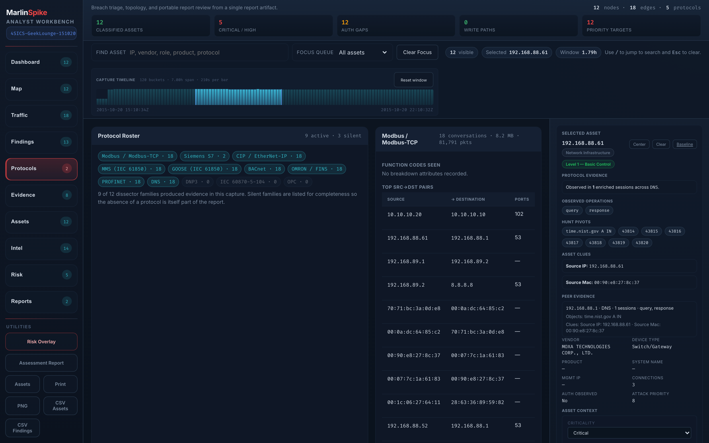

# Workbench Guide

The workbench is what you spend an engagement inside. It's the screen
that opens when you click any report — `/api/reports/<filename>` —
and it's where MarlinSpike turns a PCAP into something an analyst can
actually triage.

This guide walks every surface of the workbench. It's long because
the workbench is dense: ten left-rail modes, an interactive topology
canvas, a right-side sidebar with seven stacked panels, a time
scrubber, an assessment-report drawer, and a per-asset baseline
shortcut. Read it once start-to-finish so you know what's where; come
back for individual sections when you need a refresher.

For the analyst loop that *uses* these surfaces, see
[triage-methodology.md](triage-methodology.md). For project-level
aggregation across many reports, see
[projects-and-engagements.md](projects-and-engagements.md).

---


## Layout

```
┌─────────────────────────────────────────────────────────────────────────┐
│ [global nav]  Dashboard | Reports | Scans | Live Capture | …            │
├─────────────────────────────────────────────────────────────────────────┤
│ left rail │   topology canvas / pane content   │  sidebar (right)       │
│ ──────────│ ───────────────────────────────────│ ───────────────────────│
│ Dashboard │                                    │ Selected Asset         │
│ Map       │   [interactive viewport with a]    │ Operator Snapshot      │
│ Traffic   │   [Purdue-banded topology, panes]  │ Priority Targets       │
│ Findings  │   [or table renderings depending]  │ Auth Gaps              │
│ Protocols │   [on the active rail mode]        │ Write-capable Paths    │
│ Evidence  │                                    │ L2/ARP Anomalies       │
│ Assets    │   ┌──── time scrubber histogram ───┐ Suspicious External   │
│ Intel     │   │ packet rate over capture span │ Protocol Mix           │
│ Risk      │   └────────────────────────────────┘ Legend                 │
│ Reports   │                                    │                        │
│           │   [provenance chips above content] │                        │
│ Utilities │                                    │                        │
│ ─Risk     │                                    │                        │
│ ─Report   │                                    │                        │
│ ─Print    │                                    │                        │
│ ─PNG      │                                    │                        │
│ ─CSV asse│                                     │                        │
│ ─CSV find│                                     │                        │
└─────────────────────────────────────────────────────────────────────────┘
```

The center viewport changes based on the **left-rail mode** you pick.
Some modes show the topology graph (Map, Risk overlay), others
replace the canvas with a stacked content view (Traffic, Findings,
Protocols, etc.). The right-side sidebar is always present and
context-tracks whatever you click.

---

## Provenance chips

Above the content area, a row of small labeled chips shows where the
report came from. Always check these first. They are the answer to
"is this even the right capture?"

| chip | what it means |
|---|---|
| `Source` | Filename, or `live:<iface>:<rotation>` if the report came from live capture. |
| `Link type` | Datalink layer dumpcap saw — `EN10MB`, `LINUX_SLL2`, etc. |
| `Packets` | Total observed in the capture (post-BPF if filtered). |
| `Duration` | Wall-clock span from first to last packet. |
| `Unique MACs` | Distinct L2 endpoints in the capture. |
| `Unique IPs` | Distinct L3 endpoints. |

A capture with 12 packets, 2 MACs, and a 4-second duration is **not
the right capture for assessment**. Stop here and re-collect.

The chip strip was a v3.1.0 fix — earlier releases silently rendered
empty values when the engine and viewer disagreed on field names.
Both naming conventions are now accepted.

---

## Left-rail modes

The rail is the primary navigation. Each button has a label, a count
badge, and a one-line note explaining what's behind it.

### Dashboard


The default landing mode. Three components stacked top-to-bottom in
the viewport:

- **Operator Snapshot** — capture KPIs (asset count, finding count,
  CRITICAL/HIGH count, top protocol, capture duration) as a
  scannable strip. Designed to answer *"what is this capture about?"*
  in five seconds.
- **Investigation Queues** — clickable buttons that filter the
  Findings pane to a specific cut: all CRITICAL, all `*_NO_AUTH_*`,
  all `*_DNS_*`, all `*_BEACON_*`, etc. Each shows its current count.
- **Top Findings** — the highest-severity findings table, capped at
  10. Click any row to jump to the Findings pane with that finding
  pre-selected.

The badge on the Dashboard rail button is the **priority count**
(CRITICAL + HIGH).

### Map


The topology canvas. Force-directed graph with **Purdue band layout**
on the vertical axis: external nodes sit at the top (Level 5),
enterprise IT at Level 4, supervisory at Level 3, control at Level 2,
field/control at Level 1, and process at Level 0.

Visual encoding:

| element | meaning |
|---|---|
| circle size | connection count (degree) — bigger = more peers |
| circle color | role — engineering workstation, HMI, PLC, RTU, switch, router, server, external, etc. The **Legend** sidebar panel decodes the palette. |
| solid edge | bidirectional / read-write traffic |
| dashed edge | unidirectional / read-only traffic |
| edge label | when zoomed in: protocol + dst port + transport |
| edge color | severity inheritance from the most-severe finding involving this edge (when the Risk overlay is on) |

Interactions:

- **Click a node** → Selected Asset sidebar populates with everything
  known about it. The viewport pans to center.
- **Drag a node** → reposition it. Layout sticks until you reload.
- **Wheel scroll** → zoom around the cursor.
- **Right-click background** → reset zoom and layout.

### Traffic


Replaces the canvas with the Traffic Statistics pane (v3.1.0):

- **Capture-volume KPIs** — bytes total, conversations, top
  protocol, peak rate, mean rate.
- **Top conversations by bytes** — top-25 table, src/dst/protocol/
  byte/packet columns. Each row has a click-to-pivot affordance: the
  src and dst become clickable and select the corresponding asset.
- **Protocol byte distribution** — stacked-bar of where the capture's
  bytes actually went. OT engagements often look "Modbus-heavy" by
  packet count but TLS-heavy by bytes; this is the chart that tells
  you so.
- **Top source / destination endpoints** — separate tables. An
  endpoint that's a top-10 talker on both axes is your usual SCADA
  poller; an endpoint that's a top-10 destination only is often the
  more interesting node.
- **Conversation-anomaly flags** — beaconing, high-entropy DNS,
  unsecured OPC. Each is a chip that links into the Findings pane.
- **Extract** column — clickable button that POSTs to
  `/api/reports/<filename>/extract` and downloads a sub-PCAP for the
  conversation, honoring any active time-window filter. See
  [time-scrubbing-and-extract.md](time-scrubbing-and-extract.md).

### Findings


The risk-finding triage surface. Sorted by severity (CRITICAL → INFO)
then occurrence count. Each finding row shows:

- **Severity badge** — color-coded; if a contextual-severity overlay
  has applied, the badge has a small "→ CRITICAL (asset criticality)"
  pill explaining the bump or drop. See
  [asset-context.md](asset-context.md).
- **Category** — engine-emitted finding category, e.g.
  `EXTERNAL_C2_BEACON_LIKELY`, `OT_NO_AUTH_OBSERVED`,
  `CLEARTEXT_REMOTE_ACCESS`.
- **Affected nodes / edges** — clickable; selects on the Map.
- **Description** — engine-emitted, locale-flipped (EN/FR) at render.
- **Remediation** — engine-emitted, IEC 62443 SR-oriented, also
  locale-flipped.
- **ATT&CK chips** — tactic / technique / sub-technique IDs that
  this finding maps to. Click to open the Intel pane filtered to
  that technique.
- **Note affordance** — if a finding has a saved note, the note
  status (`open` / `investigating` / `resolved` / `false_positive`)
  and body render inline with an "Edit note…" button. New notes get
  saved against the finding's stable signature so they survive
  re-runs of the same capture. See
  [asset-context.md](asset-context.md).

### Protocols



The Protocol Drilldown pane (v3.1.0). Per-dissector evidence with a
header **Protocol Roster** chip-set listing every family the engine
checked for, with present families lit and silent families dimmed.
The dim chips matter — *absence* of a protocol you'd expect on this
network is itself a finding.

For each present family (Modbus, S7, DNP3, IEC 60870-5-104, CIP,
MMS, GOOSE, BACnet, OMRON, PROFINET, OPC, DNS):

- **Function-code / object-group / type-ID breakdown** — chip row
  with counts. For Modbus this is `Read Holding Registers ×4031`,
  `Write Single Coil ×12`, etc. The presence of a write function
  code on a network where you didn't expect writes is something you
  drill on.
- **Top-10 src→dst pair table** — per-conversation evidence with
  click-to-pivot endpoints and an Extract column.

### Evidence


DPI-enriched sessions and hunt pivots. Surfaces what the Rust DPI
engine collected beyond the topology: encrypted-channel attributes,
JA3 / JA3S fingerprints when available, OPC discovery responses,
PROFINET DCP identifiers, S7 job parameters, and so on. The badge is
the count of high-signal observations.

This pane is the right place to jump when a finding refers to "S7
program upload" and you want to know *which S7 jobs* the engine
actually saw.

### Assets


The full asset ledger. Sortable, filterable, with per-asset depth
columns:

| column | content |
|---|---|
| MAC / IP | identity, the latter shows alongside in mono |
| Vendor | from OUI lookup or DPI-derived (when available) |
| Role | engineering workstation, HMI, PLC, RTU, switch, router, server, external, … |
| Device type | finer-grained — `S7-300 PLC`, `Allen-Bradley ControlLogix`, `Schneider Quantum`, when fingerprinting succeeded |
| Purdue | inferred level (0-5) |
| Findings | count of risk findings touching this asset |
| Protocols | count of distinct dissector families |
| Identity depth | lit when ≥3 independent identity sources agree (MAC + DPI + protocol behavior) |
| Baseline | click-through to the per-asset longitudinal page (v3.2.0) |

Filter toolbar at the top: substring search across MAC / IP / vendor
/ role. Filters are AND'd. Reset clears.

### Intel


ATT&CK and extension-intelligence overlay.

- **MITRE ATT&CK matrix view** — tactics across the top, techniques
  down. Cells lit when the capture has at least one finding mapping
  to that technique. Hover for the technique name; click to filter
  the Findings pane to all findings mapping to it. Both Enterprise
  ATT&CK and ICS ATT&CK are loaded; each technique chip shows a
  small `E` or `I` domain marker. ICS chips render in a distinct red
  styling because they are usually the more interesting hits in OT.
- **Per-tactic detection coverage** — count of distinct techniques
  surfaced by tactic.
- **Plugin-intel surfaces** — APT and ARP plugin findings render
  here too when their families are present.

For the deeper ATT&CK reading model (how MarlinSpike reasons about
tactics, the response-guidance overlay, IEC 62443 alignment), see
[mitre-attack-guide.md](mitre-attack-guide.md).

### Risk

The same topology canvas as Map, but with a **risk overlay**: nodes
and edges colored by the highest-severity finding that touches them.
A red node with a thick red ring is a node implicated in a CRITICAL
finding. Edges inherit the severity of any finding referencing them.

Legend in the sidebar swaps to a severity-color legend when this
mode is active.

### Reports

Module-stage view. Each analysis stage emits its own structured
artifact (capture summary, conversations, topology, risk, ATT&CK,
APT, ARP, malware IOC). This pane shows the raw module outputs for
each stage as collapsible sections — useful for downstream tooling
authors and as a sanity-check when a finding doesn't make sense.

The badge is the total number of module views available for the
current report.

---

## Right sidebar

The sidebar is always visible to the right of the viewport. Panels
auto-collapse when they have nothing to show, so the layout adapts to
the capture. From top to bottom:

### Selected Asset


What's known about whatever you last clicked on the Map (or in any
table that pivots back to the Map). When nothing is selected, this
panel shows an empty state with a hint.

When populated:

- **Identity header** — IP, MAC, vendor, role, device type, Purdue
  level. If the capture has multiple IPs for one MAC, all are
  listed.
- **Asset Context** (editable, v3.1.0) — owner, criticality
  (`low` / `medium` / `high` / `critical`), zone, business function,
  free-text. Tags persist project-wide and key on MAC first / IP
  fallback. See [asset-context.md](asset-context.md).
- **Service ports** — TCP and UDP ports the asset listened on (when
  conversation evidence supports it).
- **Per-asset findings** — finding rows that touch this asset.
- **Peer set** — endpoints this asset talks with, with byte / packet
  counts and protocols.
- **Center / Clear / Baseline buttons** — Center re-centers the
  topology on this node; Clear resets the selection; Baseline opens
  the per-asset longitudinal page in a new tab. See
  [asset-baselines.md](asset-baselines.md).

### Operator Snapshot

Capture-wide KPIs: asset count, conversation count, finding count,
CRITICAL/HIGH count, protocol count. Always visible regardless of
selection.

### Priority Targets

Up to 8 highest-priority assets, ranked by a composite of
finding-severity, finding-count, identity-depth, and Purdue-level
implications. The badge on the Dashboard rail mode is this list's
length capped at 8.

### Auth Gaps

Assets the engine flagged with `NO_AUTH_OBSERVED` or
`CLEARTEXT_REMOTE_ACCESS` family findings. Auth-capable protocols
(SSH, HTTPS, Modbus, OPC-UA) only — protocols that don't carry auth
(ARP, mDNS, DHCP, ICMP, LLDP) are correctly excluded after the
v2.0.1 fix.

### Write-capable Paths

Edges where the engine observed write traffic — Modbus write coil /
holding register, S7 download, CIP forward-write, etc. These are the
edges that, in a compromise scenario, take you from observation to
actuation.

### L2 / ARP Anomalies (v3.1.0)

bilgepump-derived anomalies grouped by type: `arp_spoof`, `mac_flap`,
`mac_local`, `mac_multicast`, `arp_gratuitous`. Each type shows a
count, severity histogram, and representative samples (capped at 8
buckets, walks ≤5000 entries to keep the panel responsive on huge
captures). ARP observations from the tshark path render here too.

### Suspicious External

External destinations — public-IP peers — flagged by C2 detection
(beaconing, encrypted-channel suspicion, persistent long-lived
flow). Multicast traffic is correctly excluded after the v2.0.1
fix.

### Protocol Mix

Stacked summary of the capture's protocol distribution by
conversation count and packet count. Useful sanity check: if you
expected Modbus and you see DNS dominating, you have a routing
problem upstream of the SPAN port.

### Legend

Decodes the topology palette. In Risk mode, swaps to the severity
palette.

---

## Time scrubber (v3.1.0)


Below the toolbar, an adaptive packet-rate histogram spans the full
capture timeline. It's computed from `report.conversations[]
.first_seen` / `.last_seen` into ~120 buckets that scale with
capture span — a 30-second capture gets sub-second buckets, a
3-day capture gets hour buckets.

Interactions:

- **Drag** to select a time window.
- The selection propagates **live** through the
  `timeFilteredConversations()` helper to every conversation-driven
  pane: Traffic Statistics, Protocol Drilldown's per-pair tables,
  the Findings pane (when the finding is conversation-rooted), the
  Selected Asset peer set.
- **Click outside the selection** to clear the window.

The Extract column on Traffic and Protocol Drilldown tables uses the
active window — extracted PCAPs only contain packets in that range.

For the carve-out details, see
[time-scrubbing-and-extract.md](time-scrubbing-and-extract.md).

---

## Assessment Report drawer

A toggleable bottom drawer (Risk-overlay button → Assessment Report)
that reformats the capture into a written assessment:

- **Executive summary** — capture context (source, span, asset
  count, finding count) plus the headline severity claim.
- **Risk findings** — each finding with description, remediation,
  ATT&CK chips, and IEC 62443 SR alignment.
- **Asset inventory** — sortable table with role, vendor, device
  type, Purdue level.
- **Protocol breakdown** — distribution table with packet and byte
  shares.
- **Purdue violations** — cross-zone communication called out
  separately.

The drawer is print-friendly. The Print utility button (left rail
bottom) renders this drawer in a print-formatted layout suitable for
PDF export.

---

## Report sub-tabs

Above the assessment drawer (when not toggled), two tabs:

- **Report** — the assessment text (default).
- **MAC Table** — sortable MAC-to-IP recon table with vendor,
  capabilities, and source attribution. Color-coded source badges
  (LLDP / CDP / STP / DHCP / DNS / observed). MAC-only nodes from
  L2 packets are merged into IP-keyed counterparts after the v1.9.0
  fix, so a switch broadcasting LLDP from an unconfigured port no
  longer ends up classified as "Engineering Workstation."

---

## Utilities (left-rail bottom)

Six action buttons below the rail:

| button | what it does |
|---|---|
| Risk overlay | toggle the topology severity coloring on/off |
| Assessment report | toggle the bottom assessment drawer |
| Assets | open `/api/reports/<filename>/assets` in a new tab — full asset JSON, useful for piping to other tools |
| Print | print-formatted layout (use browser PDF export to save) |
| PNG | export the topology canvas to PNG |
| CSV assets | every asset row as CSV |
| CSV findings | every finding row as CSV |

CSV exports are useful for external auditor handoff or for diffing
captures by hand.

---

## Localization

The locale picker lives in the global nav (right side, between
"About" and your username). Picking a locale persists for the
session and is also remembered by `Accept-Language` fallback for
fresh sessions. The workbench flips:

- All Jinja chrome (every label, button, header).
- All JS-rendered surfaces — every pane, every sidebar panel, every
  empty state, every prompt.
- Engine-emitted finding categories, descriptions, and remediations
  (the eight highest-frequency engine categories have full FR
  translations as of v3.1.0; the rest fall back to EN with FR
  category labels and remediations on the engine side).

What does **not** flip:

- Field-collected text (asset hostnames, DNS queries, free-text
  asset notes you wrote in EN).
- Vendor names.
- Protocol names.

For more, see [i18n-and-locale.md](i18n-and-locale.md).

---

## Keyboard

Most workbench interactions are mouse-driven, but a few keystrokes
help during heavy triage:

| key | effect |
|---|---|
| `Esc` | clear current selection / close drawer / close modal |
| `/` | focus the Assets pane filter input (when Assets mode is active) |
| arrow keys with Asset selected | navigate to the next / previous peer in the peer set |

---

## When to leave the workbench

The workbench is the right tool for triaging *one* report. When you
need to reason across many:

- **Same project, multiple reports** — go to the project page and
  hit the **Overview** tab. See
  [projects-and-engagements.md](projects-and-engagements.md). The
  Overview rolls up assets, findings, protocols, and ATT&CK
  coverage across every report in the project.
- **Same asset, longitudinally** — click the Baseline button in the
  Selected Asset sidebar. See
  [asset-baselines.md](asset-baselines.md). The baseline page
  walks every report in the project for one asset.
- **Cross-report IOC scan** — go to `/iocs`. See
  [ioc-threat-hunting.md](ioc-threat-hunting.md).

The workbench loads one report. The project surfaces are how you
think across captures.
